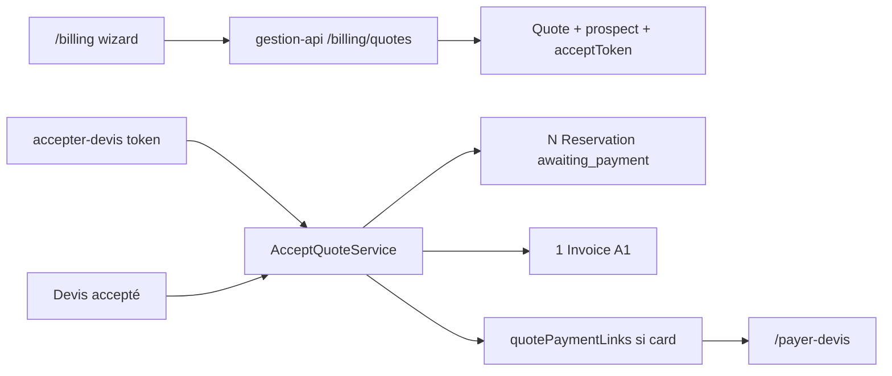

# Devis / Facturation — miroir plan

> Plan détaillé : [`docs/superpowers/plans/2026-07-23-devis-facturation.md`](../../docs/superpowers/plans/2026-07-23-devis-facturation.md)

## Locked decisions (FINAL)

| #     | Décision                                                                                                                                                                                                      |
| ----- | ------------------------------------------------------------------------------------------------------------------------------------------------------------------------------------------------------------- |
| **1** | Multi-espace **A + A1** ; lien `quoteId` only — **B/C REJECTED**                                                                                                                                              |
| **2** | Draft delete = **hard delete** + audit (`quote.deleted`)                                                                                                                                                      |
| **3** | Stripe **B** : `/payer-devis` + PI + Elements — **pas** Payment Links natifs                                                                                                                                  |
| **4** | Ventilation **TVA acompte** sur PDF facture = **OUI**                                                                                                                                                         |
| **5** | Montant link = `depositAmountTTC` si `% > 0`, sinon full TTC (`paymentSituation`)                                                                                                                             |
| **6** | TTL `awaiting_payment` = **`Quote.validUntil`**                                                                                                                                                               |
| **7** | `ClientAccount.status` **+= `"pending_activation"`** — extension enum réelle (`active` \| `locked` \| `anonymized` \| `pending_activation`) ; **pas** reuse de `locked`. Naming **LOCKED**.                   |
| **8** | Auth reject pending : code **`ACCOUNT_PENDING_ACTIVATION`** + message dédié — **DISTINCT** de `ACCOUNT_LOCKED` ; branch séparée sur verify / resolve / booking accountMode (jamais générique « not active »). |

## Global constraints (extrait)

- **`pending_activation`** = statut dédié staff-accept bootstrap (§5.1.3) — distinct de `locked` (désactivation Contacts).
- Login pending → **`ACCOUNT_PENDING_ACTIVATION`** (ex. « Ce compte n'est pas encore activé. Consultez votre email pour définir votre mot de passe. ») — **jamais** le message / code `ACCOUNT_LOCKED`.

## Contexte figé

- Schema `quotes` sans CRUD → ajouter `draft`, `cardexId` **optionnel**, `prospect`/`clientDraft`, `acceptTokenHash`, `reservationIds`.
- `/billing` = MarkTransferReceived → **enrichir**.
- `Reservation` = 1 `spaceId` → N résas à l’accept (A) + 1 Invoice (A1).
- **Plus** d’invitation `new_client` avant send — accept unifié.
- SEPA prélèvement = **stub UI only** (futur chantier).
- **§5.1.3 VALIDATED (2026-07-23)** — sous-chantier **#1 schema** peut démarrer.

## Accept unifié (résumé §5.1)

1. **Send immédiat** même sans cardex/compte (identité dans `prospect`).
2. Un lien « Accepter le devis » (email + PDF) → compte si besoin → recap → card Elements / RIB / stub SEPA → `AcceptQuoteService`.
3. Staff « Devis accepté » → **même** service ; si pas de compte : bootstrap Cardex + owner **`status: "pending_activation"`** + email MDP (**§5.1.3 — VALIDATED 2026-07-23**). Auth reject = **`ACCOUNT_PENDING_ACTIVATION`** ≠ `ACCOUNT_LOCKED`.

## Stripe (résumé §5.9)

| Point           | Décision                                               |
| --------------- | ------------------------------------------------------ |
| Booking as-is ? | Non ; réutiliser `applyStripeCardPayment` + webhook PI |
| Architecture    | **LOCKED B** custom `/payer-devis`                     |
| QR              | `qrcode` dans invoice-pdf                              |
| Expiry link     | aligné `validUntil` + until paid                       |
| Montant         | LOCKED #5                                              |

Roadmap : **#9** après accept **#8**.

## Architecture (résumé)

- Guard : **`BillingPermissionGuard`**.
- Slice 2 = accept token / bootstrap — **plus** slice « invite new_client pré-send ».

## Sous-chantiers 1–10

schema → **accept token + bootstrap** → pricing → CRUD (+ delete draft) → locks → UI → PDF devis → accept atomique → **Stripe link/QR** → E2E.

## Open questions (reste)

1. ~~**Valider §5.1.3**~~ — **VALIDATED (2026-07-23)** ; naming `pending_activation` **LOCKED**.
2. ~~Champs minimaux `prospect` pour send~~ — **LOCKED product a (2026-07-23)** : email + `(firstName AND lastName) OR displayName` (`QuoteSendProspectSchema`).
3. ~~TTL token accept~~ — **LOCKED product b (2026-07-23)** : `acceptTokenExpiresAt = min(validUntil, now + 30 days)`.

## Product locks a/b (2026-07-23)

| Id    | Décision                                                                   | Statut     |
| ----- | -------------------------------------------------------------------------- | ---------- |
| **a** | Send prospect : `(firstName AND lastName) OR displayName` — pas email seul | **LOCKED** |
| **b** | Accept token TTL : `min(validUntil, now + 30d)`                            | **LOCKED** |
