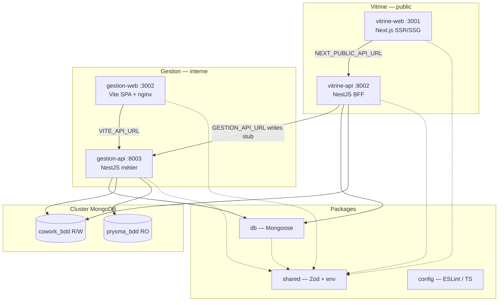

# Architecture Cowork Prysme

Ce document décrit les choix structurants du monorepo à quatre applications. Il ne couvre pas le métier applicatif.

## Vue d'ensemble

Quatre applications déployables indépendamment, deux environnements (public / interne), packages partagés et un cluster MongoDB unique.



## Rôles des applications

| App             | Stack                | Port | Rôle                                                                                      |
| --------------- | -------------------- | ---- | ----------------------------------------------------------------------------------------- |
| **vitrine-web** | Next.js App Router   | 3001 | Frontend public SEO. Aucun accès direct à la base.                                        |
| **vitrine-api** | NestJS (ESM)         | 8002 | BFF public. Lit `cowork_bdd` uniquement. Délègue les écritures à gestion-api (stub HTTP). |
| **gestion-web** | Vite + React + nginx | 3002 | Frontend CRM interne (SPA).                                                               |
| **gestion-api** | NestJS (ESM)         | 8003 | Cœur métier. Écritures sur `cowork_bdd`, lecture seule `prysma_bdd`.                      |

## Flux inter-services

### Vitrine (public)

1. Le navigateur charge **vitrine-web** (SSR/SSG).
2. Les appels API passent par `NEXT_PUBLIC_API_URL` → **vitrine-api**.
3. **vitrine-api** lit `cowork_bdd` via `packages/db` (`DbModule` fin, sans `@nestjs/mongoose`).
4. Les opérations d'écriture futures seront déléguées à **gestion-api** via `GESTION_API_URL` (stub `GestionClientService` en place).

### Gestion (interne)

1. **gestion-web** (SPA statique) appelle **gestion-api** via `VITE_API_URL`.
2. **gestion-api** centralise la logique métier et l'accès aux deux bases.

## Monorepo : pnpm + Turborepo

**pnpm workspaces** avec `workspace:*`. **Turborepo** orchestre le cache et l'ordre de build (`dependsOn: ["^build"]`).

Presets TypeScript dans `packages/config` :

- `typescript/nextjs.json` — vitrine-web
- `typescript/nestjs.json` — APIs Nest (NodeNext / ESM)
- `typescript/vite.json` — gestion-web
- `typescript/library.json` — packages compilés

## Sécurité

### Variables d'environnement

Validation Zod centralisée dans `packages/shared/src/env.ts`, parsers dédiés par app :

| Parser               | Initialisation                                              |
| -------------------- | ----------------------------------------------------------- |
| `parseVitrineWebEnv` | `initVitrineWebEnv()` dans vitrine-web `instrumentation.ts` |
| `parseVitrineApiEnv` | `initVitrineApiEnv()` dans vitrine-api `main.ts`            |
| `parseGestionApiEnv` | `initGestionApiEnv()` dans gestion-api `main.ts`            |
| `parseGestionWebEnv` | côté client Vite (`import.meta.env`)                        |

| Variable               | Dev                  | Production                                  |
| ---------------------- | -------------------- | ------------------------------------------- |
| `MONGODB_URI`          | `mongodb://` accepté | `mongodb+srv://` ou `?tls=true` obligatoire |
| `ALLOWED_ORIGIN`       | liste CSV explicite  | idem, **jamais `*`**                        |
| `NEXT_PUBLIC_SITE_URL` | optionnel            | **obligatoire** (vitrine-web)               |

Messages d'erreur génériques, jamais de valeurs secrètes exposées.

### CORS (APIs Nest)

`ALLOWED_ORIGIN` est une **liste d'origines séparées par des virgules**, configurée explicitement par API :

- **vitrine-api** : origines du frontend public (ex. `http://localhost:3001`)
- **gestion-api** : frontend gestion **et** vitrine-api si appels server-side (ex. `http://localhost:3002,http://localhost:8002`)

Origine non listée = refus. Aucune dérivation automatique.

### Content-Security-Policy

| App         | Mécanisme                | `connect-src`                                                 |
| ----------- | ------------------------ | ------------------------------------------------------------- |
| vitrine-web | `next.config.ts` headers | `'self'` + origin de `NEXT_PUBLIC_API_URL`                    |
| gestion-web | nginx `add_header`       | `'self'` + origin de `VITE_API_URL` (injecté au build Docker) |

### prysma_bdd — lecture seule

- `getPrysmaDb()` **non exporté** via `@coworkprysme/db`
- **vitrine-api** n'accède **jamais** à `prysma_bdd` (`runCoworkReadinessCheck` uniquement)
- **gestion-api** seule exécute le readiness complet (cowork + prysma)
- Tests automatisés dans `packages/db`

### Health checks

| App         | Route         | Type              | Réponse                                             |
| ----------- | ------------- | ----------------- | --------------------------------------------------- |
| vitrine-web | `/api/health` | Liveness          | `{ "status": "ok" }`                                |
| gestion-web | `/api/health` | Liveness (nginx)  | `{ "status": "ok" }`                                |
| vitrine-api | `/health`     | Readiness cowork  | `{ status, timestamp, checks: { cowork } }`         |
| gestion-api | `/health`     | Readiness complet | `{ status, timestamp, checks: { cowork, prysma } }` |

Détails d'erreur dans les **logs serveur** uniquement.

## MongoDB + Mongoose (`packages/db`)

Connexion unique au cluster, bascule via `useDb()` :

```
MONGODB_URI ──► mongoose.connect()
                    ├── useDb(MONGODB_DB_COWORK)  → cowork_bdd  (R/W)
                    └── useDb(MONGODB_DB_PRYSMA)  → prysma_bdd  (RO, gestion-api)
```

Singleton serverless via cache `globalThis._mongooseCache`.

Schémas Mongoose dans `packages/db/src/models/` uniquement.

### Intégration NestJS

`DbModule` / `DbService` fins dans chaque API — wrapper autour de `packages/db`, **sans** `@nestjs/mongoose`.

## packages/shared

Schémas Zod, parsers d'environnement, contrats health (`LivenessResponseSchema`, `CoworkReadinessResponseSchema`, `ReadinessResponseSchema`).

Exports :

- `@coworkprysme/shared` — contrats publics
- `@coworkprysme/shared/server` — init env serveur (APIs Nest)
- `@coworkprysme/shared/vitrine-web` — init env vitrine-web

## Docker

Stratégie multi-stage commune :

1. **prepare** — `turbo prune --docker` pour isoler le sous-graphe de dépendances
2. **builder** — `pnpm install` (×2) + `turbo run build`
3. **runner** — image minimale, utilisateur non-root (Node) ou nginx

| App         | Runner              | Particularité                           |
| ----------- | ------------------- | --------------------------------------- |
| vitrine-web | `node:24-alpine`    | Next.js `output: "standalone"`          |
| vitrine-api | `node:24-alpine`    | `pnpm deploy --prod` → dossier autonome |
| gestion-api | `node:24-alpine`    | idem                                    |
| gestion-web | `nginx:1.27-alpine` | assets statiques + nginx.conf           |

### Coolify

- **Contexte de build** : racine du dépôt (`.`)
- **Dockerfile path** : `apps/<app>/Dockerfile`
- Variables runtime injectées via l'UI Coolify (voir README)

`pnpm deploy` requiert `inject-workspace-packages=true` et `force-legacy-deploy=true` dans `.npmrc` (pnpm v10 + lockfile partagé).

## Qualité

- TypeScript strict, ESLint 9 (flat config), Prettier
- Husky : lint-staged + Commitlint conventional
- Tests : `packages/db` (singleton, read-only prysma), `packages/shared` (env)

## Lancer une app individuellement

```bash
pnpm --filter @coworkprysme/vitrine-web dev
pnpm --filter @coworkprysme/vitrine-api dev
pnpm --filter @coworkprysme/gestion-web dev
pnpm --filter @coworkprysme/gestion-api dev
pnpm --filter @coworkprysme/db test
```

## Évolutions prévues (hors périmètre actuel)

- Modèles métier sur `cowork_bdd`
- Endpoints de délégation vitrine-api → gestion-api (au-delà du stub HTTP)
- Authentification staff via `prysma_bdd`
- CI/CD automatisé
