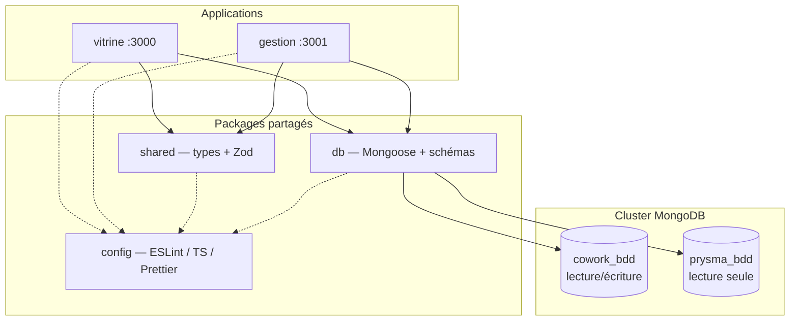

# Architecture Cowork Prysme

Ce document décrit les choix structurants du monorepo. Il ne couvre pas le métier applicatif.

## Vue d'ensemble

Deux applications Next.js distinctes consomment les mêmes packages internes et la même base applicative MongoDB, tout en restant déployables indépendamment.



## Monorepo : pnpm + Turborepo

**Pourquoi un monorepo ?** Les deux apps partagent la couche data, les types et la configuration qualité. Un monorepo évite la duplication des schémas Mongoose et garantit la cohérence des contrats API.

**pnpm workspaces** gère les dépendances inter-packages via `workspace:*`. **Turborepo** orchestre le cache et l'ordre de build (`^build` = construire les dépendances avant les consommateurs).

## Séparation vitrine / gestion

| Critère  | vitrine                    | gestion                        |
| -------- | -------------------------- | ------------------------------ |
| Audience | Public                     | Staff interne                  |
| Priorité | SEO, SSR/SSG, performance  | UX riche, temps réel (à venir) |
| Port dev | 3000                       | 3001                           |
| Metadata | Open Graph, `metadataBase` | Basique (app interne)          |

Les deux apps importent `@coworkprysme/db` et `@coworkprysme/shared` ; aucun schéma n'est défini dans les apps.

## MongoDB + Mongoose

**100 % MongoDB**, sans ORM alternatif ni SQL.

### Connexion unique, deux bases

Une seule connexion Mongoose au cluster (`MONGODB_URI`), avec bascule de base via `connection.useDb()` :

```
MONGODB_URI  ──► mongoose.connect()
                      │
                      ├── useDb(MONGODB_DB_COWORK)  → cowork_bdd  (R/W)
                      └── useDb(MONGODB_DB_PRYSMA)  → prysma_bdd  (RO)
```

Les noms de bases sont configurables par variables d'environnement (défauts : `cowork_bdd`, `prysma_bdd`), ce qui permet de changer entre dev / staging / prod sans modifier le code.

### Singleton serverless

Next.js exécute les route handlers dans un environnement serverless où les modules peuvent être réinstanciés. Le pattern utilisé :

```typescript
declare global {
  var _mongooseCache: { conn: Mongoose | null; promise: Promise<Mongoose> | null };
}
global._mongooseCache ??= { conn: null, promise: null };
```

La connexion est mise en cache sur `globalThis` et réutilisée entre les invocations. **Jamais** de nouvelle connexion par requête.

### prysma_bdd : externe et lecture seule

`prysma_bdd` est la base SSO Prysma préexistante. Le package `db` :

- n'expose **aucun modèle** pour cette base ;
- n'effectue **aucune écriture** ;
- propose uniquement un **ping** (`admin().ping()`) pour vérifier la joignabilité.

Toute création ou modification de collections sur `prysma_bdd` nécessite un accord explicite.

### Schémas : source de vérité unique

Tous les schémas Mongoose vivent dans `packages/db/src/models/`. Les apps ne définissent jamais de schémas locaux.

Modèle actuel (minimal, non métier) :

- **HealthCheck** sur `cowork_bdd` — vérifie que la connexion et les requêtes fonctionnent.

## packages/shared

Contient les types TypeScript et schémas Zod partagés entre apps. Exemple : le contrat de réponse `/api/health` est défini ici et validé côté route handler.

## packages/config

Configurations réutilisables :

- `eslint/base.js` — règles TypeScript strictes
- `eslint/next.js` — règles Next.js + React
- `typescript/base.json` — `strict: true`, `noUncheckedIndexedAccess`
- `typescript/nextjs.json` — extension pour les apps Next.js
- `typescript/library.json` — extension pour les packages compilés

## Health check

Route : `GET /api/health` (identique sur les deux apps).

```json
{
  "status": "ok",
  "timestamp": "2026-06-30T12:00:00.000Z",
  "cowork_bdd": { "connected": true, "latencyMs": 12 },
  "prysma_bdd": { "connected": true, "latencyMs": 8 }
}
```

| `status`   | Condition                          | HTTP |
| ---------- | ---------------------------------- | ---- |
| `ok`       | Les deux bases répondent           | 200  |
| `degraded` | Connexion OK mais erreur partielle | 200  |
| `error`    | Au moins une base injoignable      | 503  |

## Qualité

- **TypeScript** strict dans tout le monorepo
- **ESLint 9** (flat config) + **Prettier**
- **Husky** : pre-commit (lint-staged) + commit-msg (Commitlint conventional)
- **Turborepo** : `lint` et `typecheck` en pipeline

## Lancer une app individuellement

```bash
# Vitrine seule
pnpm --filter @coworkprysme/vitrine dev

# Gestion seule
pnpm --filter @coworkprysme/gestion dev

# Package db seul (build)
pnpm --filter @coworkprysme/db build
```

## Évolutions prévues (hors périmètre actuel)

- Modèles métier sur `cowork_bdd`
- Authentification staff via `prysma_bdd` (lecture)
- Temps réel dans `gestion`
- CI/CD et déploiement
