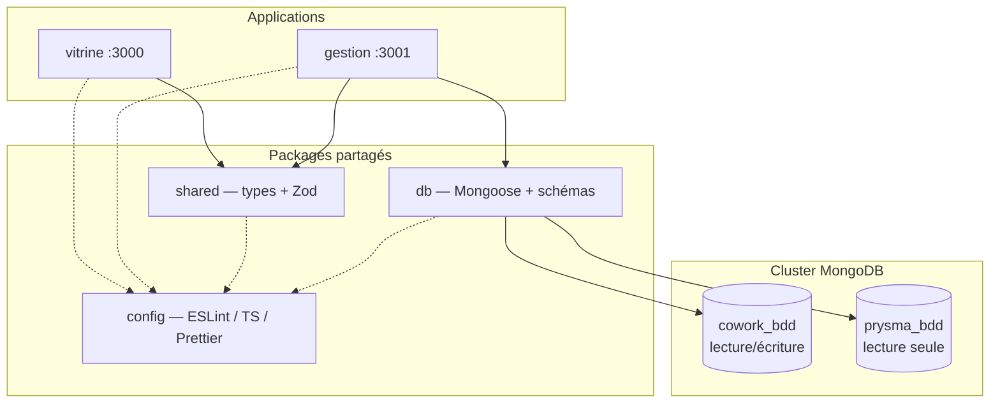

# Architecture Cowork Prysme

Ce document décrit les choix structurants du monorepo. Il ne couvre pas le métier applicatif.

## Vue d'ensemble

Deux applications Next.js distinctes consomment les mêmes packages internes et la même base applicative MongoDB, tout en restant déployables indépendamment.



## Monorepo : pnpm + Turborepo

**Pourquoi un monorepo ?** Les deux apps partagent la couche data, les types et la configuration qualité. Un monorepo évite la duplication des schémas Mongoose et garantit la cohérence des contrats API.

**pnpm workspaces** gère les dépendances inter-packages via `workspace:*`. **Turborepo** orchestre le cache et l'ordre de build (`^build` = construire les dépendances avant les consommateurs).

## Séparation vitrine / gestion

| Critère  | vitrine                    | gestion                        |
| -------- | -------------------------- | ------------------------------ |
| Audience | Public                     | Staff interne                  |
| Priorité | SEO, SSR/SSG, performance  | UX riche, temps réel (à venir) |
| Port dev | 3000                       | 3001                           |
| Metadata | Open Graph, `metadataBase` | Basique (app interne)          |

Les deux apps importent `@coworkprysme/shared`. Seule **gestion** importe `@coworkprysme/db` ; aucun schéma n'est défini dans les apps.

## Sécurité

### Variables d'environnement

Validation Zod centralisée dans `packages/shared/src/env.ts`, initialisée au démarrage serveur via `instrumentation.ts` (`initServerEnv()`).

| Variable               | Dev                  | Production                                 |
| ---------------------- | -------------------- | ------------------------------------------ |
| `MONGODB_URI`          | `mongodb://` accepté | `mongodb+srv://` ou `tls=true` obligatoire |
| `MONGODB_DB_COWORK`    | optionnel (défaut)   | optionnel (défaut)                         |
| `MONGODB_DB_PRYSMA`    | optionnel (défaut)   | optionnel (défaut)                         |
| `NEXT_PUBLIC_SITE_URL` | optionnel            | **obligatoire** (vitrine)                  |

Les messages d'erreur sont génériques et ne contiennent jamais de valeurs secrètes. Fichiers `.env*` ignorés par git (sauf `.env.example`).

### En-têtes HTTP

Les deux apps configurent via `next.config.ts` :

- Content-Security-Policy (base, à affiner)
- Strict-Transport-Security
- X-Content-Type-Options, X-Frame-Options
- Referrer-Policy, Permissions-Policy

### prysma_bdd — lecture seule garantie

- `getPrysmaDb()` n'est **pas** exporté via `@coworkprysme/db` (index public)
- Seul `pingPrysmaDb()` (interne) effectue un `admin().ping()` — aucune écriture
- Tests automatisés : absence d'exports sensibles, ping sans `model()`, singleton Mongoose

### Health checks

| App     | Type      | DB                   | Réponse publique                                                          |
| ------- | --------- | -------------------- | ------------------------------------------------------------------------- |
| vitrine | Liveness  | Aucune               | `{ "status": "ok" }` — HTTP 200                                           |
| gestion | Readiness | Ping cowork + prysma | `{ status, timestamp, checks: { cowork, prysma } }` — booléens uniquement |

Les détails d'erreur (host, port, stack) vont dans les **logs serveur**, jamais dans la réponse HTTP.

## MongoDB + Mongoose

**100 % MongoDB**, sans ORM alternatif ni SQL.

### Connexion unique, deux bases

Une seule connexion Mongoose au cluster (`MONGODB_URI`), avec bascule de base via `connection.useDb()` :

```
MONGODB_URI  ──► mongoose.connect()
                      │
                      ├── useDb(MONGODB_DB_COWORK)  → cowork_bdd  (R/W)
                      └── useDb(MONGODB_DB_PRYSMA)  → prysma_bdd  (RO)
```

Les noms de bases sont configurables par variables d'environnement (défauts : `cowork_bdd`, `prysma_bdd`), ce qui permet de changer entre dev / staging / prod sans modifier le code.

### Singleton serverless

Next.js exécute les route handlers dans un environnement serverless où les modules peuvent être réinstanciés. Le pattern utilisé :

```typescript
declare global {
  var _mongooseCache: { conn: Mongoose | null; promise: Promise<Mongoose> | null };
}
global._mongooseCache ??= { conn: null, promise: null };
```

La connexion est mise en cache sur `globalThis` et réutilisée entre les invocations. **Jamais** de nouvelle connexion par requête.

### prysma_bdd : externe et lecture seule

`prysma_bdd` est la base SSO Prysma préexistante. Le package `db` :

- n'expose **aucun modèle** pour cette base ;
- n'expose **pas** `getPrysmaDb()` dans l'API publique ;
- n'effectue **aucune écriture** — uniquement un ping interne (`admin().ping()`) ;
- est couvert par des **tests** interdisant les exports d'écriture.

Toute création ou modification de collections sur `prysma_bdd` nécessite un accord explicite.

### Schémas : source de vérité unique

Tous les schémas Mongoose vivent dans `packages/db/src/models/`. Les apps ne définissent jamais de schémas locaux.

Modèle actuel (minimal, non métier) :

- **HealthCheck** sur `cowork_bdd` — vérifie que la connexion et les requêtes fonctionnent.

## packages/shared

Contient les types TypeScript et schémas Zod partagés entre apps. Exemple : le contrat de réponse `/api/health` est défini ici et validé côté route handler.

## packages/config

Configurations réutilisables :

- `eslint/base.js` — règles TypeScript strictes
- `eslint/next.js` — règles Next.js + React
- `typescript/base.json` — `strict: true`, `noUncheckedIndexedAccess`
- `typescript/nextjs.json` — extension pour les apps Next.js
- `typescript/library.json` — extension pour les packages compilés

## Health check

Route : `GET /api/health` sur les deux apps, **contrats distincts**.

**Vitrine (liveness)** — pas d'accès base de données :

```json
{ "status": "ok" }
```

**Gestion (readiness)** — ping des deux bases, réponse assainie :

```json
{
  "status": "ok",
  "timestamp": "2026-06-30T12:00:00.000Z",
  "checks": { "cowork": true, "prysma": true }
}
```

| `status`   | Condition (gestion)                | HTTP |
| ---------- | ---------------------------------- | ---- |
| `ok`       | Les deux checks à `true`           | 200  |
| `degraded` | Connexion OK mais erreur partielle | 200  |
| `error`    | Au moins un check à `false`        | 503  |

## Qualité

- **TypeScript** strict dans tout le monorepo
- **ESLint 9** (flat config) + **Prettier**
- **Husky** : pre-commit (lint-staged) + commit-msg (Commitlint conventional)
- **Turborepo** : `lint` et `typecheck` en pipeline

## Lancer une app individuellement

```bash
# Vitrine seule
pnpm --filter @coworkprysme/vitrine dev

# Gestion seule
pnpm --filter @coworkprysme/gestion dev

# Package db seul (build)
pnpm --filter @coworkprysme/db build
```

## Évolutions prévues (hors périmètre actuel)

- Modèles métier sur `cowork_bdd`
- Authentification staff via `prysma_bdd` (lecture)
- Temps réel dans `gestion`
- CI/CD et déploiement
