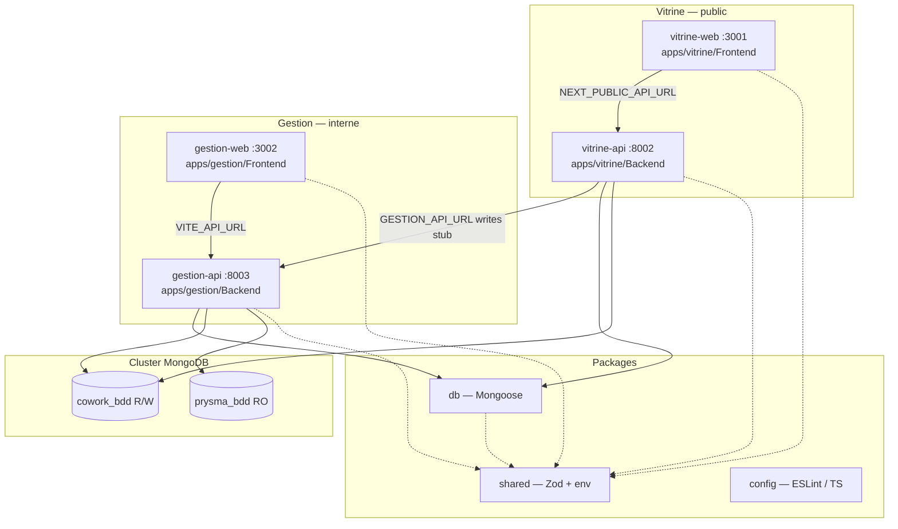
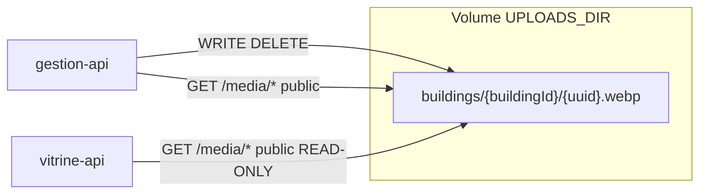

# Architecture Cowork Prysme

Ce document décrit les choix structurants du monorepo à quatre applications. Il ne couvre pas le métier applicatif.

## Vue d'ensemble

Quatre applications déployables indépendamment, regroupées par environnement (`vitrine` / `gestion`), packages partagés et un cluster MongoDB unique.



## Arborescence apps

```
apps/
├── vitrine/
│   ├── Frontend/    @coworkprysme/vitrine-web   (Next.js)
│   └── Backend/     @coworkprysme/vitrine-api    (NestJS)
└── gestion/
    ├── Frontend/    @coworkprysme/gestion-web   (Vite + nginx)
    └── Backend/     @coworkprysme/gestion-api    (NestJS)
```

Les **noms npm** (`@coworkprysme/vitrine-web`, etc.) sont inchangés — seuls les chemins filesystem diffèrent. Turborepo et `pnpm --filter` continuent de cibler par nom de package.

## Rôles des applications

| App (package)   | Stack                | Port | Rôle                                                                                      |
| --------------- | -------------------- | ---- | ----------------------------------------------------------------------------------------- |
| **vitrine-web** | Next.js App Router   | 3001 | Frontend public SEO. Aucun accès direct à la base.                                        |
| **vitrine-api** | NestJS (ESM)         | 8002 | BFF public. Lit `cowork_bdd` uniquement. Délègue les écritures à gestion-api (stub HTTP). |
| **gestion-web** | Vite + React + nginx | 3002 | Frontend CRM interne (SPA).                                                               |
| **gestion-api** | NestJS (ESM)         | 8003 | Cœur métier. Écritures sur `cowork_bdd`, lecture seule `prysma_bdd`.                      |

## Flux inter-services

### Vitrine (public)

1. Le navigateur charge **vitrine-web** (SSR/SSG).
2. Les appels API passent par `NEXT_PUBLIC_API_URL` → **vitrine-api**.
3. **vitrine-api** lit `cowork_bdd` via `packages/db` (`DbModule` fin, sans `@nestjs/mongoose`).
4. Les opérations d'écriture futures seront déléguées à **gestion-api** via `GESTION_API_URL` (stub `GestionClientService` en place).

### Gestion (interne)

1. **gestion-web** (SPA statique) appelle **gestion-api** via `VITE_API_URL`.
2. **gestion-api** centralise la logique métier et l'accès aux deux bases.

## Monorepo : pnpm + Turborepo

**pnpm workspaces** avec glob `apps/*/*` + `packages/*`. **Turborepo** orchestre le cache et l'ordre de build (`dependsOn: ["^build"]`).

### `dist/` des packages library (`shared`, `db`, `invoice-pdf`)

`packages/shared`, `packages/db` et `packages/invoice-pdf` publient via `main` / `exports` vers **`dist/*.js`**, et `dist/` est **gitignoré**. Les apps (Next, Nest, Vite) consomment donc le build local, pas le `src/` TypeScript.

Husky régénère `dist/` automatiquement quand les sources de ces packages changent :

| Hook            | Quand                                                                              |
| --------------- | ---------------------------------------------------------------------------------- |
| `pre-commit`    | fichiers sous `packages/shared/`, `packages/db/` ou `packages/invoice-pdf/` stagés |
| `post-merge`    | pull/merge qui touche ces packages                                                 |
| `post-checkout` | changement de branche qui touche ces packages                                      |

**Limites assumées** (le hook ne peut pas tout couvrir) :

- `git commit --no-verify` (ou `HUSKY=0`) → le rebuild pre-commit est sauté
- édition de `packages/shared`, `packages/db` ou `packages/invoice-pdf` **sans** commit → `dist/` peut rester périmé jusqu’à un rebuild manuel

Dans ces cas :

```bash
pnpm --filter @coworkprysme/shared build
pnpm --filter @coworkprysme/db build
pnpm --filter @coworkprysme/invoice-pdf build
# ou : pnpm turbo run build --filter=@coworkprysme/shared --filter=@coworkprysme/db --filter=@coworkprysme/invoice-pdf
```

Presets TypeScript dans `packages/config` :

- `typescript/nextjs.json` — vitrine-web
- `typescript/nestjs.json` — APIs Nest (NodeNext / ESM)
- `typescript/vite.json` — gestion-web
- `typescript/library.json` — packages compilés

## Sécurité

### Variables d'environnement

Validation Zod centralisée dans `packages/shared/src/env.ts`, parsers dédiés par app :

| Parser               | Initialisation                                                            |
| -------------------- | ------------------------------------------------------------------------- |
| `parseVitrineWebEnv` | `initVitrineWebEnv()` dans `apps/vitrine/Frontend/src/instrumentation.ts` |
| `parseVitrineApiEnv` | `initVitrineApiEnv()` dans `apps/vitrine/Backend/src/main.ts`             |
| `parseGestionApiEnv` | `initGestionApiEnv()` dans `apps/gestion/Backend/src/main.ts`             |
| `parseGestionWebEnv` | côté client Vite (`import.meta.env`)                                      |

| Variable               | Dev                  | Production                                  |
| ---------------------- | -------------------- | ------------------------------------------- |
| `MONGODB_URI`          | `mongodb://` accepté | `mongodb+srv://` ou `?tls=true` obligatoire |
| `ALLOWED_ORIGIN`       | liste CSV explicite  | idem, **jamais `*`**                        |
| `NEXT_PUBLIC_SITE_URL` | optionnel            | **obligatoire** (vitrine-web)               |

### CORS (APIs Nest)

`ALLOWED_ORIGIN` est une **liste d'origines séparées par des virgules**, configurée explicitement par API :

- **vitrine-api** : origines du frontend public (ex. `http://localhost:3001`)
- **gestion-api** : frontend gestion **et** vitrine-api si appels server-side (ex. `http://localhost:3002,http://localhost:8002`)

### Content-Security-Policy

| App         | Mécanisme                              | `connect-src`                                                 |
| ----------- | -------------------------------------- | ------------------------------------------------------------- |
| vitrine-web | `apps/vitrine/Frontend/next.config.ts` | `'self'` + origin de `NEXT_PUBLIC_API_URL`                    |
| gestion-web | nginx `add_header`                     | `'self'` + origin de `VITE_API_URL` (injecté au build Docker) |

### prysma_bdd — lecture seule

- `getPrysmaDb()` **non exporté** via `@coworkprysme/db`
- **vitrine-api** n'accède **jamais** à `prysma_bdd` (`runCoworkReadinessCheck` uniquement)
- **gestion-api** seule exécute le readiness complet (cowork + prysma)

### Health checks

| App         | Route         | Type              | Réponse                                             |
| ----------- | ------------- | ----------------- | --------------------------------------------------- |
| vitrine-web | `/api/health` | Liveness          | `{ "status": "ok" }`                                |
| gestion-web | `/api/health` | Liveness (nginx)  | `{ "status": "ok" }`                                |
| vitrine-api | `/health`     | Readiness cowork  | `{ status, timestamp, checks: { cowork } }`         |
| gestion-api | `/health`     | Readiness complet | `{ status, timestamp, checks: { cowork, prysma } }` |

## MongoDB + Mongoose (`packages/db`)

Connexion unique au cluster, bascule via `useDb()` :

```
MONGODB_URI ──► mongoose.connect()
                    ├── useDb(MONGODB_DB_COWORK)  → cowork_bdd  (R/W)
                    └── useDb(MONGODB_DB_PRYSMA)  → prysma_bdd  (RO, gestion-api)
```

`DbModule` / `DbService` fins dans chaque API — wrapper autour de `packages/db`, **sans** `@nestjs/mongoose`.

### Modèle de données `cowork_bdd`

Source de vérité : [`docs/cowork_bdd_schema.md`](docs/cowork_bdd_schema.md).

**21 collections métier** (+ `health_checks` technique) enregistrées **uniquement** sur la connexion cowork via `getCoworkDb()` / `registerAllCoworkModels()` — jamais via `mongoose.model()` global, jamais sur `prysma_bdd`.

| Domaine         | Collections                                                                  |
| --------------- | ---------------------------------------------------------------------------- |
| **structure**   | `buildings`, `spaces`, `slotClosures`                                        |
| **reservation** | `reservations`, `slotLocks`, `reservationRequests`                           |
| **client**      | `clientAccounts`, `cardex`                                                   |
| **staff**       | `staffProfiles`, `auditLogs`                                                 |
| **pricing**     | `tariffs`, `services`, `discountCodes`                                       |
| **billing**     | `quotes`, `invoices`, `payments`                                             |
| **peripheral**  | `notifications`, `reviews`, `satisfactionSurveys`, `newsOffers`, `incidents` |

Conventions : montants en **centimes entiers**, dates UTC, snapshots figés sur `reservations` / factures, TVA **par ligne** + `vatBreakdown[]` agrégé.

### Verrou temporaire (`slotLocks`)

Collection distincte des réservations — mutex pendant le tunnel client (10 min).

- Index TTL : `{ expiresAt: 1 }` avec `expireAfterSeconds: 0` (purge automatique).
- Index unique : `{ spaceId, startAt, endAt }` (anti-collision exacte).
- À la lecture : tout lock avec `expiresAt < now` est traité comme invalide (le moniteur TTL Mongo peut prendre ~60 s).

Helpers : `acquireLock()`, `releaseLock()`, `findActiveLock()`.

### Anti-chevauchement réservations

MongoDB n'exprime pas l'unicité sur des plages qui se chevauchent. Stratégie :

1. Lock = mutex sur créneau exact (index unique ci-dessus).
2. `createReservation()` = **transaction Mongo** : vérifie l'absence de réservation `pending`/`confirmed` chevauchante (`startAt < newEnd AND endAt > newStart`), puis insert atomique. Échec explicite si conflit — pas de dégradation silencieuse.

### Exigence replica set (déploiement Coolify)

Les transactions Mongo (`createReservation`) exigent un **replica set** (un nœud unique configuré en RS suffit). Un `mongod` standalone **ne permet pas** les transactions.

- Le TTL des locks fonctionne sans replica set ; les transactions, non.
- Utilitaire : `assertReplicaSetForTransactions()` / `detectReplicaSet()` dans `packages/db`.
- **Action Coolify** : configurer MongoDB avec `--replSet rs0` + `rs.initiate()`, ou utiliser un cluster managé.

Les tests d'intégration de `packages/db` démarrent un replica set mono-nœud en mémoire (`mongodb-memory-server`) à chaque run CI.

### `auditLogs` immuable

Journal de conformité : `at` (horodatage métier) + `createdAt`/`updatedAt` auto, mais **aucune modification** après insertion (middleware Mongoose bloque save/update/delete).

### `prysma_bdd` — garde-fous

- Aucun modèle enregistré sur la connexion prysma.
- Aucune opération d'écriture vers prysma dans `packages/db`.
- `getPrysmaDb()` non exporté ; seul `pingPrysmaDb()` (admin ping) touche prysma.

## Docker

Stratégie multi-stage : `turbo prune --docker` → build → runner non-root (ou nginx).

| App         | Dockerfile                         | Runner                                                          |
| ----------- | ---------------------------------- | --------------------------------------------------------------- |
| vitrine-web | `apps/vitrine/Frontend/Dockerfile` | Next.js standalone — `CMD node apps/vitrine/Frontend/server.js` |
| vitrine-api | `apps/vitrine/Backend/Dockerfile`  | `pnpm deploy --prod`                                            |
| gestion-web | `apps/gestion/Frontend/Dockerfile` | nginx                                                           |
| gestion-api | `apps/gestion/Backend/Dockerfile`  | `pnpm deploy --prod`                                            |

## Stockage fichiers — photos bâtiments

Les **métadonnées** (`storageKey`, `alt?`, `order`, `isPrimary`) sont persistées dans `cowork_bdd.buildings.photos[]`. Les **binaires** sont stockés sur un volume disque partagé. **`prysma_bdd` n'est jamais touchée.**



| Service         | Volume Coolify                          | Accès disque      | Rôle                                                                 |
| --------------- | --------------------------------------- | ----------------- | -------------------------------------------------------------------- |
| **gestion-api** | `/data/uploads` (lecture/écriture)      | R/W               | Upload, suppression, nettoyage ; sert `/media` pour gestion-web      |
| **vitrine-api** | **même volume** (montage **read-only**) | **Lecture seule** | Sert `/media` pour la vitrine publique — indépendante de gestion-api |

> **Persistent storage OBLIGATOIRE** sur gestion-api (écriture) et vitrine-api (lecture). Sans volume monté, chaque redéploiement recrée un filesystem éphémère → **perte de toutes les photos** alors que les `storageKey` restent en base.

### Variables d'environnement

| Variable                         | gestion-api | vitrine-api | Défaut local     | Production (Coolify)              |
| -------------------------------- | ----------- | ----------- | ---------------- | --------------------------------- |
| `UPLOADS_DIR`                    | oui         | oui         | `{repo}/uploads` | `/data/uploads` (**obligatoire**) |
| `UPLOAD_MAX_BYTES`               | oui         | —           | `5242880` (5 Mo) | idem                              |
| `UPLOAD_MAX_PHOTOS_PER_BUILDING` | oui         | —           | `15`             | idem                              |
| `UPLOAD_MAX_DIMENSION_PX`        | oui         | —           | `2048`           | idem                              |

La limite **5 Mo est appliquée côté serveur** (magic bytes + sharp), indépendamment de toute validation front.

Structure sur le volume :

```
UPLOADS_DIR/
└── buildings/
    └── {buildingId}/
        └── {uuid}.webp
```

`storageKey` en base = chemin relatif (`buildings/{buildingId}/{uuid}.webp` ou `spaces/{spaceId}/{uuid}.webp`). Upload protégé par permission `spaces` ; voir ci-dessous pour la lecture publique.

### Politique `/media` — accès public volontaire

`GET /media/buildings/:buildingId/:filename` et `GET /media/spaces/:spaceId/:filename` sont **volontairement sans authentification** sur gestion-api et vitrine-api.

| Aspect          | Choix                                                                                                                                                                                         |
| --------------- | --------------------------------------------------------------------------------------------------------------------------------------------------------------------------------------------- |
| **Pourquoi**    | Les mêmes photos s'affichent sur la **vitrine publique** ; l'URL `/media/...` est stable et cacheable (CDN-friendly).                                                                         |
| **Sécurité**    | Pas de directory listing ; `storageKey` validé par regex stricte + résolution sous `UPLOADS_DIR` (path traversal impossible). Les noms de fichier sont des UUID — pas d'énumération triviale. |
| **Hors scope**  | Pas d'auth, pas de signed URLs, pas de proxy authentifié gestion-web → à documenter, pas à « corriger ».                                                                                      |
| **vitrine-api** | Montage volume **read-only** : la vitrine ne peut ni écrire ni supprimer sur le disque, même en cas de faille.                                                                                |

L'écriture (upload, suppression fichier, nettoyage) reste réservée à gestion-api avec permission `spaces`.

### Garde-fous suppression bâtiment

`DELETE /buildings/:id` est **refusé (409 Conflict)** tant qu'au moins un espace (actif **ou** archivé) référence ce `buildingId`. Pas de cascade destructive : supprimer un bâtiment ne doit jamais effacer silencieusement espaces et photos associées.

### Coolify — persistent storage (garde-fou)

| Service Coolify | Volume partagé   | Mount path      | Mode mount     | `UPLOADS_DIR`   |
| --------------- | ---------------- | --------------- | -------------- | --------------- |
| gestion-api     | `cowork-uploads` | `/data/uploads` | **Read/Write** | `/data/uploads` |
| vitrine-api     | `cowork-uploads` | `/data/uploads` | **Read-only**  | `/data/uploads` |

Le montage **read-only** sur vitrine-api est un garde-fou infra : la vitrine ne fait que lire ; elle ne peut pas modifier ni supprimer les fichiers même en cas de faille applicative.

## Mise en avant vitrine — trois mécanismes distincts

Ne pas fusionner ces mécanismes : chacun sert des pages différentes et vit dans un modèle différent.

| Mécanisme                          | Stockage                                                                             | Pilotage admin                                                    | Pages vitrine concernées                              |
| ---------------------------------- | ------------------------------------------------------------------------------------ | ----------------------------------------------------------------- | ----------------------------------------------------- |
| **1. Bâtiments catalogue**         | Champs `visibleOnVitrine`, `isDefaultVitrineBuilding` sur le document `buildings`    | Onglet **Espaces** → section Bâtiments (`PATCH /buildings/:id`)   | `/bureaux-privatifs`, `/salle-de-reunion` (catalogue) |
| **2. Espaces catalogue**           | Champs `featuredOnVitrine`, `vitrineOrder` sur le document `spaces`                  | Onglet **Espaces** → section Mise en avant (`PATCH /spaces/:id`)  | `/bureaux-privatifs`, `/salle-de-reunion` (catalogue) |
| **3. Listes éditoriales homepage** | Tableaux `featuredBuildingIds`, `featuredSpaceIds` sur le singleton `vitrineContent` | Onglets **Accès** / **Services** (`PATCH /admin/vitrine-content`) | Contact public, homepage, encarts services            |

Contrainte catalogue bâtiment : un seul `isDefaultVitrineBuilding: true` à la fois (service + index unique partiel MongoDB).

### Coolify — configuration par service

| Service Coolify | Dockerfile path                    | Build context     | Port |
| --------------- | ---------------------------------- | ----------------- | ---- |
| vitrine-web     | `apps/vitrine/Frontend/Dockerfile` | `.` (racine repo) | 3001 |
| vitrine-api     | `apps/vitrine/Backend/Dockerfile`  | `.`               | 8002 |
| gestion-web     | `apps/gestion/Frontend/Dockerfile` | `.`               | 3002 |
| gestion-api     | `apps/gestion/Backend/Dockerfile`  | `.`               | 8003 |

Les filtres `turbo prune` / `pnpm deploy` utilisent les **noms de package** (`@coworkprysme/vitrine-web`, etc.), pas les chemins filesystem.

## Dette technique — module Bâtiments & Espaces

Optimisations et durcissements **reportés** tant que le volume reste faible (peu de bâtiments/espaces). À traiter avant montée en charge :

| Sujet                          | Impact                                                                               | Piste                                                   |
| ------------------------------ | ------------------------------------------------------------------------------------ | ------------------------------------------------------- |
| **DTO summary liste**          | `GET /buildings` renvoie le schéma détail complet (horaires ×2, photos, description) | Introduire `BuildingSummary` pour la liste / carte      |
| **Résolution slug O(n)**       | `resolveUniqueSpaceSeo` charge tous les slugs à chaque create/update                 | Requêtes ciblées sur candidats `slug`, `slug-2`, …      |
| **Test scope API intégration** | Couverture unitaire des helpers ; pas de test e2e profil scoped                      | Seed + scénarios curl automatisés                       |
| **`scope.spaceTypes`**         | Champ profil staff jamais appliqué côté API                                          | Filtrer listes/écritures ou retirer du modèle           |
| **Lazy-load Leaflet**          | `BuildingsMap` (Leaflet + markercluster) dans le bundle principal (~595 kB JS)       | `React.lazy` sur la carte si le split devient pertinent |

## Emails de réservation (vitrine-api)

Après `confirmBookingCheckout` (création atomique), `BookingConfirmService` envoie les e-mails transactionnels.

### Destinataires — règle permanente

| E-mail                                      | Destinataire SMTP (`to`)  | Source                                             |
| ------------------------------------------- | ------------------------- | -------------------------------------------------- |
| Confirmation de réservation                 | **client** uniquement     | `clientAccount.email` / `result.clientEmail`       |
| Création de compte                          | **client** uniquement     | idem                                               |
| Notification staff « Nouvelle réservation » | gestionnaires du bâtiment | `resolveBookingNotificationRecipients(buildingId)` |

**`buildings.email` (contact du bâtiment) ne doit JAMAIS être un destinataire d'envoi.**  
Ce champ sert uniquement à l'**affichage** dans le corps des e-mails clients (bloc « Contact sur place »). Tout code d'envoi qui utiliserait `building.email` / `contactEmail` comme `to` est une régression.

### `resolveBookingNotificationRecipients` — en attente du module Permissions

- **Fichier** : `apps/vitrine/Backend/src/mail/resolve-booking-notification-recipients.ts`
- **Rôle** : **seul** point d'entrée pour résoudre les destinataires de la notification staff.
- **État actuel (stub)** : renvoie `[]`, ou une adresse unique si `FALLBACK_BOOKING_NOTIFICATION_EMAIL` est définie (**temporaire**, pour tests).
- **Cible future** : page Gestion → Permissions — marquer un `staffProfile` avec la permission « Reçoit les emails de réservation » + `scope.buildingIds`. Remplacer **uniquement** le corps de cette fonction (requête staffProfiles) ; ne pas toucher au template ni à l'appelant.
- Si la liste est vide : log d'avertissement, **pas** d'échec du flux de confirmation.

## Paiement Stripe Phase 4a (vitrine-api + vitrine-web)

Flux carte : confirm atomique Phase 3 → `POST /booking/payments/intent` → Payment Element → confirmation **uniquement** via webhook `payment_intent.succeeded` (signature `STRIPE_WEBHOOK_SECRET`). La facture reste `type: "proforma"` ; seuls `paidTotal`, `status` et la collection `payments` évoluent.

### Variables d'environnement

| Variable                             | App         | Rôle                            |
| ------------------------------------ | ----------- | ------------------------------- |
| `STRIPE_SECRET_KEY`                  | vitrine-api | Création PaymentIntent          |
| `STRIPE_WEBHOOK_SECRET`              | vitrine-api | Vérification signature webhook  |
| `BOOKING_PAYMENT_TOKEN_SECRET`       | vitrine-api | HMAC `paymentAccessToken` (≥32) |
| `NEXT_PUBLIC_STRIPE_PUBLISHABLE_KEY` | vitrine-web | Payment Element (iframe Stripe) |

Local : `stripe listen --forward-to localhost:8002/stripe/webhook`.

### Token d'accès paiement (`paymentAccessToken`)

À la confirm (`POST /booking/confirm`), l'API renvoie un **HMAC opaque** (`paymentAccessToken`) lié à `reservationReference` + `invoiceReference`, avec une durée de vie `min(24h, awaitingPaymentExpiresAt)`.

| Appel                           | Transmission du token                                                                        |
| ------------------------------- | -------------------------------------------------------------------------------------------- |
| `POST /booking/payments/intent` | Body JSON `paymentAccessToken`                                                               |
| `GET /booking/payments/status`  | Query `paymentAccessToken`                                                                   |
| Retour Stripe (`return_url`)    | **Jamais** dans l'URL (logs Stripe / Referer) — le front le recharge depuis `sessionStorage` |

**Compromis sessionStorage vs cookie httpOnly** : le token est stocké en `sessionStorage` (snapshot de reprise carte) pour survivre au redirect Stripe sans le coller dans l'URL. `sessionStorage` est **moins protégé qu'un cookie httpOnly** contre une XSS : choix **conscient**. Acceptable ici parce que le token a une portée limitée (une seule réservation / facture), une durée de vie courte alignée sur le hold, et **aucune** identité de compte — ce n'est pas un oubli. Ne pas « durcir » en cookie httpOnly sans revoir le flux multi-origine vitrine-web → vitrine-api et le resume après redirect.

Sans token valide (absent / faux / expiré / refs mismatch) → `401 PAYMENT_TOKEN_INVALID` (message uniforme).

## Modes de règlement du tunnel (vitrine)

Le tunnel expose au plus **deux** modes client : `paymentMethod: "card"` et `"bank_transfer"`.

- L’ancien mode client `"proforma"` / « paiement différé » a été **retiré** : il créait une réservation `confirmed` avec accès immédiat, sans RIB à l’écran — désormais couvert uniquement par le virement (éligibilité ≥ 7 jours).
- Ne pas confondre avec `invoice.type: "proforma"` (type de **document** facture), qui reste inchangé pour carte et virement.
- Les réservations historiques déjà confirmées en « proforma classique » (ex. `RES-2026-00014`) ne sont **pas** migrées.

## Paiement par virement bancaire

Option `paymentMethod: "bank_transfer"` dans le tunnel, offerte seulement si le RIB est configuré **et** si la réservation est pleinement éligible (lead time + fenêtre de paiement non vide).

### Règles

| Élément          | Valeur                                                                                           |
| ---------------- | ------------------------------------------------------------------------------------------------ |
| Lead time min    | `BANK_TRANSFER_MIN_LEAD_DAYS` (défaut **7**)                                                     |
| Fenêtre paiement | `BANK_TRANSFER_PAYMENT_WINDOW_DAYS` (défaut **8**) depuis `issuedAt`                             |
| Marge sécurité   | `BANK_TRANSFER_SAFETY_MARGIN_DAYS` (défaut **2**) avant `startAt`                                |
| Expiration       | `min(issuedAt+8j, startAt−2j)` — si `expiresAt ≤ issuedAt` → **rejet** (`window_too_short`)      |
| Libellé virement | référence réservation seule (`RES-…`)                                                            |
| Relances         | **trois** paliers seulement : J+2 / J+4 / J+6 depuis `issuedAt` (`BANK_TRANSFER_REMINDER_TIERS`) |
| Champ distinct   | `reservation.awaitingPaymentMethod: "card" \| "bank_transfer"`                                   |

**J+8 n’est pas une 4ᵉ relance.** Le défaut `BANK_TRANSFER_PAYMENT_WINDOW_DAYS = 8` (`DEFAULT_BANK_TRANSFER_PAYMENT_WINDOW_DAYS`) fixe la **fenêtre d’encaissement** et donc `awaitingPaymentExpiresAt` (avec le plafond `startAt − safetyMargin`). Au-delà : expiration du hold (`cancelled`), pas un e-mail de rappel supplémentaire. Les seuls tiers de relance sont `j2` / `j4` / `j6` (sweep `AwaitingPaymentExpiryService`).

À la confirm : statut `awaiting_payment`, emails J+0 (RIB + libellé + montant), payload `bankTransfer` dans la réponse. À l'expiration : `cancelled` + email client (pas d'annulation Stripe). Encaissement manuel : gestion → **Facturation** → `POST /billing/transfers/mark-received` (permission **`billing`**) → `Payment.method: "transfer"` + `confirmed` + email confirmation ; les relances s'arrêtent immédiatement (`markBankTransferReminderSent` ne matche plus `awaiting_payment`).

### Variables d'environnement (RIB)

| Variable                                        | App         | Rôle                  |
| ----------------------------------------------- | ----------- | --------------------- |
| `BANK_TRANSFER_IBAN` / `BIC` / `ACCOUNT_HOLDER` | vitrine-api | RIB affiché / e-mailé |
| `BANK_TRANSFER_BANK_NAME`                       | vitrine-api | Optionnel             |
| `BANK_TRANSFER_MIN_LEAD_DAYS`                   | vitrine-api | Seuil d'éligibilité   |
| `BANK_TRANSFER_PAYMENT_WINDOW_DAYS`             | vitrine-api | Fenêtre max           |
| `BANK_TRANSFER_SAFETY_MARGIN_DAYS`              | vitrine-api | Plafond avant début   |

### Rapprochement Qonto (semi-automatique)

Lecture seule (`organization.read` + `offline_access`). Le staff **confirme toujours** ; l’automation ne fait que **proposer**.

| Élément     | Comportement                                                                                              |
| ----------- | --------------------------------------------------------------------------------------------------------- |
| Matching    | Libellé Qonto contient `RES-YYYY-NNNNN` **et** `amount_cents === invoice.balanceDue` → suggestion `exact` |
| Incohérence | Même réf. mais montant différent → suggestion `amount_mismatch` (pas de lien Qonto à la confirm)          |
| Fallback    | Pas de candidate → encaissement manuel inchangé                                                           |
| Confirm     | `POST /billing/transfers/mark-received` avec `qontoTxId` optionnel → `Payment.reconciliation.qontoTxId`   |
| Sync        | Polling crédits toutes les **10 min** (+ `POST /integrations/qonto/sync`) — webhooks en V2                |
| Tokens      | Refresh token **one-time** stocké chiffré (AES-GCM) dans `qontoOAuthCredentials`                          |

#### Variables d'environnement (gestion-api)

| Variable                                  | Rôle                                                    |
| ----------------------------------------- | ------------------------------------------------------- |
| `QONTO_CLIENT_ID` / `QONTO_CLIENT_SECRET` | App Developer Portal (sandbox ou prod)                  |
| `QONTO_STAGING_TOKEN`                     | Obligatoire si `QONTO_ENV=sandbox`                      |
| `QONTO_REDIRECT_URI`                      | Ex. `http://localhost:8003/integrations/qonto/callback` |
| `QONTO_TOKEN_ENCRYPTION_KEY`              | ≥32 caractères — chiffrement des jetons en base         |
| `QONTO_ENV`                               | `sandbox` (défaut) ou `production`                      |
| `QONTO_BANK_ACCOUNT_ID`                   | Optionnel (sinon découvert via `/v2/organization`)      |
| `QONTO_POLL_INTERVAL_MS`                  | Défaut `600000` (10 min)                                |

Toutes les variables Qonto (sauf optionnelles) sont **all-or-nothing** : partiel → échec au démarrage.

#### Bootstrap OAuth (une fois)

1. Renseigner les variables dans `apps/gestion/Backend/.env`, redémarrer gestion-api.
2. Se connecter à la gestion (permission **billing**).
3. Ouvrir `GET http://localhost:8003/integrations/qonto/authorize` (session cookie) **ou** `GET …/authorize-url` pour copier l’URL.
4. Sandbox : être déjà connecté à l’app web sandbox Qonto ; SMS = `123456`.
5. Autoriser l’app → redirect vers `/integrations/qonto/callback` → page « Qonto connecté ».
6. Vérifier `GET /integrations/qonto/status` → `{ configured: true, authorized: true }`.
7. Démo : crédit sandbox libellé = `RES-…` + montant = solde dû → `POST /integrations/qonto/sync` → Facturation → suggestion → **Confirmer suggestion Qonto**.

## Qualité

- TypeScript strict, ESLint 9, Prettier, Husky + Commitlint
- Husky rebuild `packages/shared` / `packages/db` → `dist/` (voir § monorepo ci-dessus ; limites `--no-verify` / édition sans commit)
- Tests : `packages/db` (connexion, modèles cowork, lock/overlap transactionnels, isolation prysma), `packages/shared` (env)

## Lancer une app individuellement

```bash
pnpm --filter @coworkprysme/vitrine-web dev
pnpm --filter @coworkprysme/vitrine-api dev
pnpm --filter @coworkprysme/gestion-web dev
pnpm --filter @coworkprysme/gestion-api dev
pnpm --filter @coworkprysme/db test
```

## Évolutions prévues (hors périmètre actuel)

- Endpoints métier NestJS consommant les modèles `cowork_bdd`
- Endpoints de délégation vitrine-api → gestion-api (au-delà du stub HTTP)
- Authentification staff via `prysma_bdd`
- Moteur facturation / codes promo (schémas en place, logique à venir)
- Module Permissions gestion : permission « Reçoit les emails de réservation » + remplacement du stub `resolveBookingNotificationRecipients`
- Webhooks Qonto (V2) pour remplacer/compléter le polling des crédits
- CI/CD automatisé
