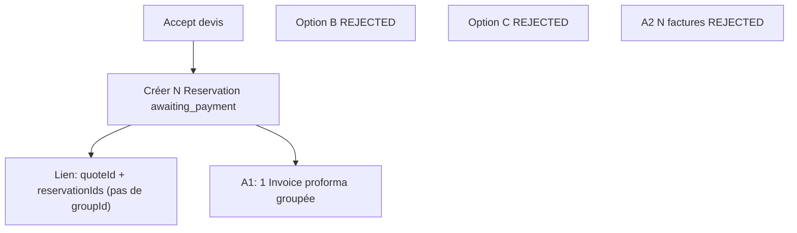
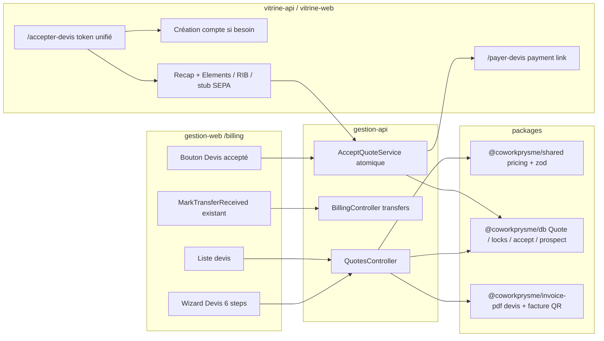
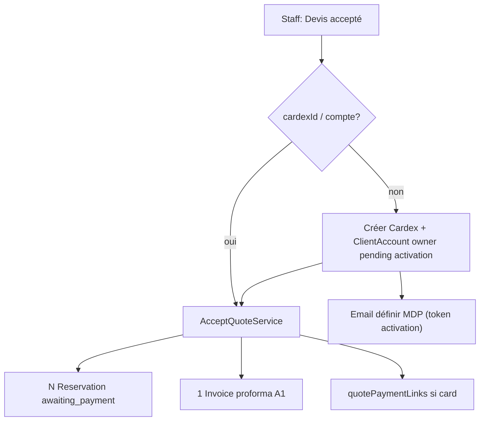
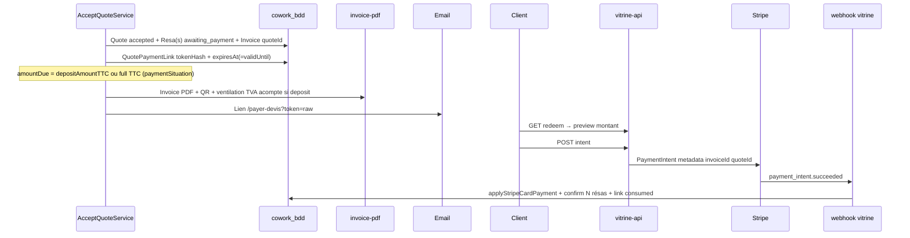

# Devis / Facturation — Plan d’implémentation

> I'm using the **writing-plans** skill to create the implementation plan.
>
> **Approche :** plan détaillé exécutable par un agent/ingénieur sans contexte préalable, découpé en sous-chantiers commitables, avec chemins de fichiers précis, décisions produit **LOCKED**, et checklist d’auto-revue.
>
> **For agentic workers:** REQUIRED SUB-SKILL: Use `superpowers:subagent-driven-development` (recommended) or `superpowers:executing-plans` to implement this plan task-by-task. Track progress with checkbox (`- [ ]`) syntax. **§5.1.3 (résolution 3.b) VALIDATED by user (2026-07-23)** — sous-chantier **#1 (schema)** peut démarrer. Les décisions § « Locked decisions » (y compris naming `pending_activation` + code auth distinct) sont figées.
>
> **Addendum Stripe (intégré) :** lien de paiement + QR sur PDF facture à l’acceptation du devis — **même chantier**, pas un chantier séparé. Voir §5.9 + sous-chantier **#9** de la roadmap. **Uniquement** factures/réservations issues de ce chantier Devis ; le tunnel booking vitrine et ses factures restent inchangés.

**Goal :** Livrer le chantier **Devis** dans l’espace Facturation : wizard staff 6 étapes, CRUD + cycle de vie devis (`draft` → `sent` → `accepted`/`refused`/`expired`), envoi **sans** bloquer sur existence cardex/compte, acceptation unifiée (client self-service **ou** staff « Devis accepté »), override tarifaire tracé, acompte %, multi-espaces (**Option A + A1**), PDF/email, à l’acceptation création automatique de réservation(s) en `awaiting_payment` **+ lien de paiement carte (Stripe custom `/payer-devis`) / QR sur PDF facture / email**, sans casser le marquage virement existant sur `/billing` ni le checkout booking existant. SEPA prélèvement = **stub UI only** (chantier futur).

**Architecture :** Enrichir le domaine Facturation déjà amorcé (`quotes` schema-only, `BillingModule` limité aux virements). La logique métier (pricing, locks, accept atomique, bootstrap cardex/compte) vit dans `packages/db` + `packages/shared` ; l’API staff dans `apps/gestion/Backend` sous `BillingPermissionGuard` ; l’UI wizard dans `apps/gestion/Frontend/src/features/billing` ; l’acceptation client / **page paiement « anytime »** / activation MDP sur vitrine. Paiement carte devis : **flux distinct** du hold tunnel booking (TTL 45 min), mais **réutilise** `applyStripeCardPayment` + metadata PaymentIntent + webhook `payment_intent.succeeded` vitrine-api. Aucune écriture sur `prysma_bdd`.

**Tech Stack :** NestJS (gestion-api / vitrine-api), React + Vite (gestion-web / vitrine-web), MongoDB/`cowork_bdd` via `@coworkprysme/db`, Zod shared (`@coworkprysme/shared`), PDF via extension de `@coworkprysme/invoice-pdf` (templates devis + facture avec QR), lib **`qrcode`** (PNG data-URL serveur), Stripe PaymentIntent + Elements (stack déjà en place — **Option B LOCKED**), mails SMTP existants, locks `slotLocks` (`SLOT_LOCK_DURATION_MS = 10 min`).

## Locked decisions (FINAL — ne pas rediscuter)

| #     | Décision                                                                                                                                                                                                                                                                                                                                                                                                                                                                                                 | Statut |
| ----- | -------------------------------------------------------------------------------------------------------------------------------------------------------------------------------------------------------------------------------------------------------------------------------------------------------------------------------------------------------------------------------------------------------------------------------------------------------------------------------------------------------- | ------ |
| **1** | Multi-espace : **Option A only** + **A1** (N `Reservation` + **une** proforma groupée). Lien via `quoteId` / `reservationIds` **uniquement** — **pas** de `groupId` séparé. Options **B** et **C** = **REJECTED**.                                                                                                                                                                                                                                                                                       | LOCKED |
| **2** | Delete draft : **hard delete** si et seulement si `status === "draft"`, avec entrée d’audit (pattern `document.deleted`).                                                                                                                                                                                                                                                                                                                                                                                | LOCKED |
| **3** | Stripe : **Option B** — page custom `/payer-devis` + PaymentIntent + Elements. **Pas** de Stripe Payment Links natifs.                                                                                                                                                                                                                                                                                                                                                                                   | LOCKED |
| **4** | Ventilation TVA de l’acompte sur PDF facture : **OUI** (exigence légale FR pour facture d’acompte).                                                                                                                                                                                                                                                                                                                                                                                                      | LOCKED |
| **5** | Montant du payment link : `depositAmountTTC` si `depositPercent > 0`, sinon solde TTC complet si immédiat / sans acompte — piloté par `paymentSituation`.                                                                                                                                                                                                                                                                                                                                                | LOCKED |
| **6** | TTL `awaiting_payment` post-accept : **aligné sur `Quote.validUntil`** — pas le hold booking 45 min, pas de TTL dédié séparé.                                                                                                                                                                                                                                                                                                                                                                            | LOCKED |
| **7** | `ClientAccount.status` enum **étendu** avec **`"pending_activation"`** (ajout réel à côté de `active` \| `locked` \| `anonymized`) — **pas** de réutilisation / détournement de `locked` ni d’un autre statut. Naming **LOCKED** : `pending_activation` (plus un choix libre).                                                                                                                                                                                                                           | LOCKED |
| **8** | Login / verify pour `pending_activation` : code **`ACCOUNT_PENDING_ACTIVATION`** + message dédié (ex. « Ce compte n'est pas encore activé. Consultez votre email pour définir votre mot de passe. ») — **DISTINCT** de `ACCOUNT_LOCKED`. Les chemins `verifyClientAccountCredentials` / resolveClientAccount / booking account verify / `accountMode: "existing"` **branchent séparément** sur `pending_activation` vs `locked` — **jamais** un générique « not active » qui fusionne les deux messages. | LOCKED |

Autres LOCKED déjà actés :

1. Accept devis → **AUTO** création réservation(s) `awaiting_payment` (paiement carte confirm ou staff mark transfer).
2. Acompte = **pourcentage** du total → montant dérivé auto.
3. Un devis peut inclure **plusieurs espaces différents**.
4. Entrée UI = Facturation uniquement.
5. **Product a (2026-07-23)** — prospect send : `(firstName AND lastName) OR displayName` (pas email seul).
6. **Product b (2026-07-23)** — accept token TTL : `min(validUntil, now + 30 days)`.

## Global Constraints

- Montants en **centimes entiers** ; recalcul **toujours côté serveur** (jamais confiance au frontend).
- **Aucune écriture sur `prysma_bdd`** — uniquement `cowork_bdd`.
- **Snapshots figés** : une fois le devis envoyé / accepté, ne pas réécrire silencieusement les montants déjà facturés ; overrides tracés (auto vs forcé).
- Facture créée à l’acceptation reste `type: "proforma"` tant que le séjour n’est pas terminé (même règle Planning manage).
- `/billing` **enrichir, ne pas remplacer** : conserver `MarkTransferReceived` + routes `POST /billing/transfers/*`.
- Devis **toujours** depuis la page Facturation (pas depuis Planning).
- Permission Facturation : `permissions.billing` (`BillingPermissionGuard`) — org-wide (pas de scope bâtiment).
- **Lien de paiement Stripe** : uniquement invoices/réservations **dérivées d’un devis** (`quoteId` présent) ; **ne pas** brancher ce flux sur les factures booking existantes.
- Secret dédié pour tokens payment-link devis (ex. `QUOTE_PAYMENT_LINK_TOKEN_SECRET` ≥32) — **ne pas** réutiliser `SESSION_SECRET` / `BOOKING_PAYMENT_TOKEN_SECRET` / `CLIENT_INVITE_TOKEN_SECRET`.
- Secret dédié pour token **accept devis** (ex. `QUOTE_ACCEPT_TOKEN_SECRET` ≥32) — même principe ; **ne pas** réutiliser les secrets ci-dessus.
- Ne **pas** `git push` / ne pas changer la branche VPS sauf demande explicite.
- **SEPA / prélèvement** : placeholder UI uniquement dans ce chantier — **aucune** collecte mandat / logique SEPA.
- **`ClientAccount.status`** : valeur enum **`"pending_activation"`** (LOCKED #7) — extension réelle de l’enum, distincte de `locked` (désactivation staff Contacts).
- **Auth reject pending** : code **`ACCOUNT_PENDING_ACTIVATION`** + message dédié (LOCKED #8) — **jamais** réutiliser `ACCOUNT_LOCKED` / le message « Ce compte a été désactivé… » pour un compte en attente d’activation MDP.

---

## 1. Header — contexte figé (état actuel du repo)

| Zone                        | État actuel                                                                                             | Fichiers                                                             |
| --------------------------- | ------------------------------------------------------------------------------------------------------- | -------------------------------------------------------------------- |
| Schema Quote                | Existe, **pas de CRUD/API/UI**                                                                          | `packages/db/src/domains/billing/quote.schema.ts`                    |
| Statuts Quote               | `sent` / `accepted` / `refused` / `expired` — **pas de `draft`**                                        | `packages/db/src/lib/enums.ts` → `QUOTE_STATUSES`                    |
| BillingLine                 | Pas de `spaceId` ; champs prix uniquement                                                               | `packages/db/src/lib/subdocuments.ts`                                |
| Reservation                 | **Exactement un** `spaceId` + `spaceSnapshot`                                                           | `packages/db/src/domains/reservation/reservation.schema.ts`          |
| Invoice                     | Un `reservationId?` optionnel                                                                           | `packages/db/src/domains/billing/invoice.schema.ts`                  |
| `/billing`                  | Uniquement lookup + mark-received virement                                                              | `apps/gestion/Backend/src/billing/*`, `MarkTransferReceivedPage.tsx` |
| Disponibilité               | `packages/db` (`availability.ts`, `locks.ts`)                                                           | `SLOT_LOCK_DURATION_MS = 10 * 60 * 1000`                             |
| Pricing                     | `resolveSpaceStayPricing` — meilleur palier, **pas d’override**                                         | `packages/shared/src/planning-manage.ts`                             |
| Deposit                     | Enums seulement (`PAYMENT_KINDS` inclut `deposit`, `PAYMENT_SITUATIONS` inclut `deposit`)               | `enums.ts`                                                           |
| Invitation collaborateur    | Cardex **obligatoire**, role `member` — **reste inchangé** ; **ne sert plus** de pré-requis send devis  | `client-account-invitation.schema.ts`, `client-invitation.ts`        |
| Statut paiement hold        | Nom exact : **`awaiting_payment`** (déjà dans `RESERVATION_STATUSES` + `BLOCKING_RESERVATION_STATUSES`) | `enums.ts`                                                           |
| Stripe booking              | PI + Elements + webhook vitrine ; gate `awaiting_payment` + TTL **45 min** ; token HMAC non persisté    | `apps/vitrine/Backend/src/stripe/booking-payment.service.ts`         |
| Stripe Payment Links natifs | **Absents** (0 usage) — **REJECTED** pour ce chantier                                                   | —                                                                    |
| Stripe gestion-api          | **Refunds only** (Vague 3)                                                                              | `apps/gestion/Backend/src/stripe/*`                                  |
| Lib QR                      | **Absente** du monorepo                                                                                 | `packages/invoice-pdf/package.json`                                  |

Doc schema de référence : `docs/cowork_bdd_schema.md` §7 (`quotes`).

---

## 2. Multi-espaces à l’acceptation — DÉCISION LOCKED

### Constats techniques (rappel)

1. **`Reservation.spaceId`** est un seul `ObjectId` requis + `spaceSnapshot` unique. Calendrier, occupancy, locks, manage = **1 espace / 1 réservation**.
2. **`BillingLine`** n’a **pas** de `spaceId` aujourd’hui — les lignes devis doivent porter espace + créneau.
3. **`Quote.reservationId`** et **`Invoice.reservationId`** singuliers — insuffisants pour N réservations.

### Décision LOCKED : Option A + A1

- À l’accept : créer **N** documents `Reservation` (une par ligne espace / créneau), chacune `status: "awaiting_payment"`, même `cardexId` / `clientAccountId`.
- Lien : `Reservation.quoteId` + `Quote.reservationIds: ObjectId[]` (déprécier `Quote.reservationId` singulier, ou le mapper = `reservationIds[0]` lecture seule).
- **Pas** de `groupId` séparé — le devis (`quoteId`) est le seul agrégat.
- Facture : **A1** — **une** facture proforma groupée (lignes multi-espaces, `quoteId` + `reservationIds[]` sur Invoice ; `reservationId` primaire = première ou conservé pour compat).

### REJECTED

| Option                                      | Motif de rejet                                                               |
| ------------------------------------------- | ---------------------------------------------------------------------------- |
| **B** — Étendre `Reservation` multi-espaces | Blast radius Planning / booking / manage — hors budget Devis                 |
| **C** — Primary + related / `groupId`       | Indirection inutile ; `quoteId` suffit                                       |
| **A2** — N factures                         | UX Facturation / paiement / acompte plus lourde ; un seul paiement par devis |



**Implications A+A1**

| Domaine            | Impact                                                                                                                                    |
| ------------------ | ----------------------------------------------------------------------------------------------------------------------------------------- |
| Calendrier UI      | Naturel : N barres — **aucun** changement de modèle calendrier                                                                            |
| Locks              | N holds `awaiting_payment` bloquants — atomique : tout ou rien                                                                            |
| Invoice / payments | Un paiement / un mark-transfer / un payment-link pour le groupe                                                                           |
| Accept atomicité   | Transaction Mongo : Quote + N Reservation + 1 Invoice + bootstrap cardex/compte si besoin + release locks                                 |
| Planning manage    | Chaque résa gérable indépendamment — attention effets de bord sur facture groupée (cancel partiel = chantier vigilance, pas redesign ici) |

---

## 3. Architecture overview



```mermaid
sequenceDiagram
  participant Staff
  participant API as gestion-api
  participant DB as cowork_bdd
  participant Client
  participant Vit as vitrine-api

  Staff->>API: Wizard save draft / send (cardex optionnel)
  API->>DB: Quote draft→sent + acceptTokenHash + prospect snapshot
  API->>Client: Email + PDF devis (lien Accepter le devis)
  alt Client self-service
    Client->>Vit: GET accept token
    opt Pas de compte
      Client->>Vit: Création compte (email prérempli, CGV, MDP)
    end
    Client->>Vit: Page recap + mode paiement (card/RIB/stub SEPA)
    Client->>Vit: Valider → AcceptQuoteService
  else Staff oral
    Staff->>API: POST accept (Devis accepté)
    Note over API,DB: Bootstrap Cardex + ClientAccount pending activation si besoin
    API->>DB: AcceptQuoteService (même txn)
  end
  Note over API,Vit,DB: Txn: Quote accepted + Reservation(s) awaiting_payment + Invoice + payment link si card
  Note over Client,Vit: Email + PDF facture QR → /payer-devis OU RIB
```

### Permissions

| Surface                                                           | Guard                                                | Pourquoi                                                             |
| ----------------------------------------------------------------- | ---------------------------------------------------- | -------------------------------------------------------------------- |
| CRUD devis, send, accept staff, refuse, expire, delete draft, PDF | **`BillingPermissionGuard`** (`permissions.billing`) | Nav Facturation déjà gated `billing` ; artefact commercial/financier |
| Documents / contacts Planning                                     | inchangé (`ClientsPermissionGuard`)                  | Hors chantier                                                        |
| Invitation collaborateur existante                                | inchangé                                             | **Hors** flux devis send/accept                                      |

Alignement UI : `navigation.ts` item `billing` → `permission: "billing"`.

---

## 4. Data model changes

### 4.1 `QUOTE_STATUSES` — ajouter `draft`

Fichier : `packages/db/src/lib/enums.ts`

```ts
export const QUOTE_STATUSES = ["draft", "sent", "accepted", "refused", "expired"] as const;
```

Transitions autorisées (serveur) :

| From    | To                                 | Qui                                                                       |
| ------- | ---------------------------------- | ------------------------------------------------------------------------- |
| —       | `draft`                            | create                                                                    |
| `draft` | `draft`                            | update                                                                    |
| `draft` | `sent`                             | send (**pas** de prérequis cardex)                                        |
| `sent`  | `accepted` / `refused` / `expired` | accept / refuse / job ou expire manuel                                    |
| `draft` | (supprimé)                         | **hard delete** + audit — **LOCKED** ; uniquement si `status === "draft"` |

Mettre à jour `docs/cowork_bdd_schema.md` §7 et tout Zod miroir shared.

### 4.2 Enrichissements `Quote`

Fichier : `packages/db/src/domains/billing/quote.schema.ts` (+ subdocuments si besoin)

| Champ                                                            | Type                                        | Rôle                                                                                                                                 |
| ---------------------------------------------------------------- | ------------------------------------------- | ------------------------------------------------------------------------------------------------------------------------------------ |
| `status`                                                         | enum + **`draft`**                          | brouillon                                                                                                                            |
| `cardexId`                                                       | ObjectId?                                   | **optionnel** jusqu’à accept (ou posé au staff-accept bootstrap) — **ne bloque plus** `send`                                         |
| `clientAccountId`                                                | ObjectId?                                   | contact principal ; optionnel jusqu’à accept / bootstrap                                                                             |
| `prospect` / `clientDraft`                                       | embedded doc                                | identité client **avant** cardex : email, nom, téléphone, company?, adresse facturation? — **requis pour send** si pas de cardex lié |
| `lines`                                                          | étendu (voir 4.3)                           | multi-espaces + services                                                                                                             |
| `depositPercent`                                                 | number 0–100                                | pourcentage acompte                                                                                                                  |
| `depositAmountTTC` / `depositAmountHT` / ventilation TVA acompte | cents dérivés                               | snapshot au calcul / send ; **ventilation TVA PDF facture = OUI** (LOCKED #4)                                                        |
| `paymentSituation`                                               | aligné `PAYMENT_SITUATIONS`                 | pilote montant dû payment-link (LOCKED #5)                                                                                           |
| `paymentMethodPreferred`                                         | `card` \| `bank_transfer` \| `direct_debit` | choisi à la création ; `direct_debit` = stub UI accept only                                                                          |
| `validUntil`                                                     | Date                                        | validité devis **et** borne TTL `awaiting_payment` post-accept (LOCKED #6)                                                           |
| `internalNote`                                                   | string?                                     | **staff-only**, jamais PDF/email client                                                                                              |
| `publicConditions` / `paymentTermsLabel`?                        | string?                                     | texte conditions client                                                                                                              |
| `reservationId`                                                  | déprécier                                   | migrer vers `reservationIds: ObjectId[]`                                                                                             |
| `reservationIds`                                                 | ObjectId[]                                  | rempli à l’accept (Option A)                                                                                                         |
| `sentAt` / `acceptedAt` / `refusedAt` / `expiredAt`              | Date?                                       | traçabilité                                                                                                                          |
| `createdByStaffProfileId`                                        | ObjectId                                    | auteur                                                                                                                               |
| `acceptTokenHash`                                                | string?                                     | token opaque hashé — **un seul** token = preuve identité + accès devis (path client)                                                 |
| `acceptTokenExpiresAt`                                           | Date?                                       | **LOCKED product b** : `min(validUntil, now + 30d)` à l’émission (`QUOTE_ACCEPT_TOKEN_MAX_TTL_MS`)                                   |
| `acceptedBy`                                                     | `"client"` \| `"staff"` + refs              | audit chemin d’accept                                                                                                                |

**Prospect / clientDraft (indicatif) :**

```ts
{
  email: string;          // requis pour send sans cardex
  firstName?: string;
  lastName?: string;
  displayName?: string;
  phone?: string;
  companyName?: string;
  billingAddress?: { /* lines, city, postalCode, country */ };
}
```

**LOCKED product a (2026-07-23) — send sans cardex :** email + `(firstName AND lastName) OR displayName` (`QuoteSendProspectSchema`). Draft peut rester plus permissif (`QuoteProspectSchema` = email seul OK). Aligné `resolveProspectIdentity`.

À l’accept (staff ou client), ces champs alimentent la création / réutilisation `Cardex` + `ClientAccount`.

### 4.3 Lignes devis multi-espaces + override

Proposition `QuoteLine` (subdocument) :

```ts
{
  lineId: string;
  kind: "space" | "service" | "fee" | "discount" | "other";
  label: string;

  spaceId?: ObjectId;
  buildingId?: ObjectId;
  startAt?: Date;
  endAt?: Date;
  partySize?: number;
  durationClass?: DurationClass;
  units?: number;

  calculatedUnitPriceHT: number;
  calculatedTotalHT: number;
  calculatedTotalVAT: number;
  calculatedTotalTTC: number;

  forcedUnitPriceHT?: number;
  unitPriceHT: number;
  qty: number;
  vatRate: number;
  discount: number;
  totalHT: number;
  totalVAT: number;
  totalTTC: number;

  priceSource: "auto" | "forced";
  priceOverrideReason?: string;
  priceOverriddenByStaffProfileId?: ObjectId;
  priceOverriddenAt?: Date;
}
```

`vatBreakdown` + `totals` = agrégats des totaux **effectifs**.

**Acompte :**

```
depositAmountTTC = roundCents(totals.ttc * depositPercent / 100)
```

- ventilation TVA acompte (prorata des taux des lignes / règles FR figées à l’impl) pour le PDF facture — **LOCKED #4**. Ne **pas** inventer une ligne « acompte » dans `lines` qui fausse le HT séjour.

### 4.4 Reservation / Invoice (Option A + A1 LOCKED)

- `Reservation.quoteId?: ObjectId` (+ index `{ quoteId: 1 }`)
- `Quote.reservationIds: ObjectId[]`
- `Invoice.quoteId?: ObjectId` (+ index) — discriminant devis-derived
- `Invoice.reservationIds?: ObjectId[]` (A1) ; `reservationId` = primaire optionnel pour compat
- `Reservation.awaitingPaymentExpiresAt` = aligné **`Quote.validUntil`** (LOCKED #6)

### 4.5 `ClientAccount.status` — `pending_activation` (LOCKED #7)

Fichier : `packages/db/src/lib/enums.ts` (+ miroir Zod `packages/shared`)

```ts
export const CLIENT_ACCOUNT_STATUSES = [
  "active",
  "locked",
  "anonymized",
  "pending_activation", // LOCKED naming — staff-accept bootstrap §5.1.3
] as const;
```

- **Extension réelle** de l’enum — **pas** reuse / misuse de `locked`.
- Auth reject (LOCKED #8) : code `ACCOUNT_PENDING_ACTIVATION` + message dédié, **distinct** de `ACCOUNT_LOCKED` — branchements séparés sur tous les chemins verify / login.

### 4.6 Invitation collaborateur — hors flux devis

**RETIRÉ** du pré-requis send : plus d’étape « invitation `new_client` avant envoi ».

L’invitation collaborateur Planning reste telle quelle pour les membres d’un cardex existant. Le flux devis utilise :

- **token accept devis** (client self-service) pour création compte à la volée ;
- **activation MDP** post staff-accept (token dédié, pattern invitation opaque+hash+TTL) — voir §5.1.3.

### 4.7 Payment link devis (`quotePaymentLinks`)

Voir §5.9.3 — collection dédiée + `Invoice.quoteId` discriminant.

### 4.8 Hard delete draft + audit

- Endpoint `DELETE /billing/quotes/:id` — **uniquement** si `status === "draft"` ; sinon 409/400.
- Audit : `quote.deleted` (payload `{ quoteId, … }`) — même esprit que `document.deleted`.
- Libérer locks wizard associés.

---

## 5. Sections détaillées

### 5.1 Acceptation unifiée (remplace l’ancienne invitation new_client avant send)

> **CRITICAL FLOW CHANGE.** L’ancien flux « invitation `new_client` → wait accept → puis send devis » est **supprimé**. Send immédiat autorisé sans cardex. Un seul bouton/lien « Accepter le devis » (email + PDF) = même token, même endpoint.

#### 5.1.1 Send sans cardex

- `POST …/send` **ne bloque pas** sur existence `cardexId` / `clientAccountId`.
- Prérequis send : lignes valides, `validUntil`, `prospect`/`clientDraft` **complet si pas de cardex**, snapshots pricing figés, `acceptToken` émis (raw en email/PDF ; hash en DB).
- Si cardex existant déjà lié au devis : ok ; le token accept saute la création compte.

#### 5.1.2 Path client self-service (token accept)

Un seul lien « Accepter le devis » (email **et** PDF) → vitrine :

1. `GET` redeem token → charge devis (lignes, totaux, conditions).
2. **Si pas de compte** pour l’email du devis → redirect page création compte (email prérempli depuis `prospect`/cardex ; collecter identité, password, CGV — **pattern collaborator-invite**, mais **au clic accept**, pas en amont du send).
3. **Si compte déjà existant** → skip création.
4. Puis (les deux cas) : **page recap complète** (lignes, totaux, conditions) avec mode de paiement = celui choisi **à la création du devis** :
   - **card** → Stripe Elements **inline** sur la même page (ou enchaînement immédiat vers collect PI — détail UX à figer en #8/#9 ; intent métier = même parcours accept).
   - **bank_transfer** → afficher RIB.
   - **direct_debit (prélèvement)** → **placeholder UI only** (bouton/bloc désactivé ou « bientôt ») — **aucune** logique SEPA / mandat dans ce chantier (futur chantier séparé).
5. Validation finale → appelle le **même** service atomique `AcceptQuoteService` (création Résa(s) + Invoice + payment link si card, etc.).

#### 5.1.3 Résolution 3.b — Staff-accept sans compte

> **VALIDATED by user (2026-07-23).** Implémentation du sous-chantier **#1 (schema)** autorisée. Le wiring accept / activation MDP reste dans les slices #2 / #8.

Question produit résolue : si le staff clique « Devis accepté » (accord oral) alors que le client **n’a ni cardex ni compte**, créer immédiatement Reservation + Invoice **sans attendre** que le client définisse un mot de passe.

**Design LOCKED :**

1. **Staff-accept** appelle le **même** `AcceptQuoteService` que le path client (acteur audit = `staff`).
2. Si `cardexId` / `clientAccountId` absents :
   - Créer (ou réutiliser par email) un **`Cardex`** immédiatement avec l’identité issue de `Quote.prospect` / `clientDraft` (nom, téléphone, company, adresse facturation…).
   - Créer un **`ClientAccount`** role **`owner`** lié à ce cardex, **sans mot de passe utilisable** :
     - **`status: "pending_activation"`** — **extension réelle** de l’enum `ClientAccount.status` (`active` \| `locked` \| `anonymized` \| **`pending_activation`**) ; naming **LOCKED** (plus un choix libre) ;
     - **interdit** de réutiliser / détourner `locked` (désactivation staff Contacts) ou un autre statut existant ;
     - hash MDP sentinel si le champ `passwordHash` reste requis en schema — le client **ne peut pas** se connecter tant que l’activation n’est pas faite.
3. Émettre un email **« Définir votre mot de passe »** avec token d’activation opaque + hash + TTL (même sécurité que les invitations collaborateur : `randomBytes` → hash avec secret dédié, pas de raw en DB).
4. Dans la **même transaction d’accept** : `Quote.status = accepted`, N `Reservation` `awaiting_payment`, 1 `Invoice` proforma groupée (A1), liens `quoteId` / `reservationIds`, emission payment-link si `paymentMethodPreferred === "card"`.
5. **L’activation login client ne bloque pas** l’accept ni la création facture/résa — le client active plus tard.
6. Implication schema : `Quote.cardexId` optionnel jusqu’à accept ; `prospect`/`clientDraft` **doit** porter assez d’identité à create/send pour ce path staff.
7. **Auth reject distinct (LOCKED #8)** : sur `pending_activation`, les chemins login / verify (`verifyClientAccountCredentials`, resolveClientAccount, booking account verify, `accountMode: "existing"`) renvoient **`ACCOUNT_PENDING_ACTIVATION`** + message dédié (ex. « Ce compte n'est pas encore activé. Consultez votre email pour définir votre mot de passe. ») — **jamais** `ACCOUNT_LOCKED` ni un branchement générique « not active » qui fusionne `pending_activation` et `locked` sous le même code/message.

**Ce que ce design n’est pas :**

- Pas d’invitation `new_client` séparée avant send.
- Pas d’attente MDP client avant Reservation/Invoice.
- Pas de réutilisation du status `locked` Contacts (désactivation staff) pour « pending activation » — les deux sémantiques et les deux codes d’erreur restent **strictement séparés**.



#### 5.1.4 Deux chemins → un service

| Path                           | Entrée                                                       | Bootstrap compte                                                      |
| ------------------------------ | ------------------------------------------------------------ | --------------------------------------------------------------------- |
| **a. Client self-service**     | `POST` vitrine accept token + session/compte créé à la volée | Compte créé (ou existant) **avant** la txn accept, avec MDP choisi    |
| **b. Staff « Devis accepté »** | `POST /billing/quotes/:id/accept` gestion-api                | Cardex + compte **pending activation** dans la txn si besoin (§5.1.3) |

Les deux convergent vers `AcceptQuoteService` (packages/db ou service partagé) pour la partie Quote + Reservation(s) + Invoice (+ handoff payment link).

#### Endpoints (indicatifs)

**Gestion :**

- CRUD `/billing/quotes` (voir §5.6)
- `POST /billing/quotes/:id/accept` — staff oral → AcceptQuoteService + bootstrap 3.b
- `DELETE /billing/quotes/:id` — hard delete draft + audit

**Vitrine :**

- `GET /quotes/accept/:token` (ou `/accepter-devis?token=`) — preview + état compte
- `POST /quotes/accept/:token/register` — création compte (si besoin)
- `POST /quotes/accept/:token/confirm` — validation finale → AcceptQuoteService
- Activation MDP : `GET/POST` token activation (post staff-accept) — routes dédiées ou réemploi pattern invitation **sans** confondre avec collaborateur Planning
- Payment link : `/payer-devis` (§5.9)

Fichiers clés à créer/étendre :

- `packages/db` accept domain + prospect subdoc
- `packages/shared` Zod accept DTOs + URL constants
- `apps/gestion/Backend/src/billing/quotes*.ts`
- `apps/vitrine/Backend/src/quotes-accept/*` (nouveau)
- `apps/vitrine/Frontend` pages accepter-devis + activation MDP
- **Ne plus** brancher send devis sur `planning-invitations` / `kind: new_client`

---

### 5.2 Manual price override per line

- Conserver **toujours** `calculated*` + totaux effectifs.
- `priceSource: "auto" | "forced"` ; si `forced` → `priceOverrideReason` obligatoire + staff id + timestamp.
- Helper `applyQuoteLinePricing({ calculated, forcedUnitPriceHT? })` dans `packages/shared`.
- Audit : `quote.line_price_overridden` (et éventuellement reset auto) — pattern `document.deleted` / manage cancel.

---

### 5.3 Deposit calculation

- Source de vérité : **`depositPercent`** (0–100, Zod).
- Montant dérivé serveur à chaque recalcul / au `send` (snapshot figé à l’envoi) :
  `depositAmountTTC = round(totals.ttc * depositPercent / 100)`.
- **TVA acompte (LOCKED #4)** — méthode figée dans `computeQuoteDeposit` (`packages/shared`) :
  1. allouer le TTC acompte **au prorata des parts TTC par taux** (`baseHT + vat` du `vatBreakdown`) ;
  2. pour chaque tranche : `baseHT = round(ttc * 100 / (100 + rate))`, `vat = ttc - baseHT` ;
  3. `depositAmountHT = sum(baseHT)` ; snapshot `depositVatBreakdown` — **pas** de ligne factice « acompte » dans `lines`.
- Affichage : « Acompte X % = Y € TTC » + ventilation TVA acompte sur PDF facture.
- À l’accept : `paymentSituation: "deposit"` si percent > 0 ; premier paiement attendu = `depositAmountTTC` (`Payment.kind: "deposit"`).
- Montant payment-link (LOCKED #5) : `depositAmountTTC` si `depositPercent > 0`, sinon full balance TTC selon `paymentSituation`.

---

### 5.4 Multi-space availability + locks

- Step Espaces : pour **chaque** espace + créneau, helpers `packages/db` availability.
- Locks : réutiliser `acquireLock` / `SLOT_LOCK_DURATION_MS` (10 min), `sessionId` staff stable (ex. `staff-quote:{staffProfileId}:{quoteDraftId}`).
- Refresh/heartbeat wizard ; release à abandon / send / accept ; multi-acquire atomique.

Fichiers : `packages/db/src/domains/reservation/locks.ts`, `availability.ts`, `slot-lock.schema.ts`.

---

### 5.5 Conditions documents

| Champ                                                        | Client PDF | Staff UI |
| ------------------------------------------------------------ | ---------- | -------- |
| Mode de paiement (`card` / `bank_transfer` / `direct_debit`) | oui        | oui      |
| Validité (`validUntil`)                                      | oui        | oui      |
| Conditions / mentions paiement                               | oui        | oui      |
| **`internalNote`**                                           | **non**    | oui      |

`direct_debit` visible sur conditions / recap accept en **stub** — pas de collecte SEPA.

---

### 5.6 CRUD endpoints

Base path : `/billing/quotes` (enrichit `BillingModule`, garde `/billing/transfers/*`).

| Méthode  | Path                         | Statuts autorisés                    | Notes                                              |
| -------- | ---------------------------- | ------------------------------------ | -------------------------------------------------- |
| `POST`   | `/billing/quotes`            | → `draft`                            | create ; peut stocker `prospect` sans cardex       |
| `GET`    | `/billing/quotes`            | —                                    | list filtres status/cardex/q                       |
| `GET`    | `/billing/quotes/:id`        | —                                    | detail                                             |
| `PATCH`  | `/billing/quotes/:id`        | `draft` (+ champs limités si `sent`) | update                                             |
| `DELETE` | `/billing/quotes/:id`        | `draft` only                         | **hard delete** + audit `quote.deleted`            |
| `POST`   | `/billing/quotes/:id/send`   | `draft` → `sent`                     | PDF + email + accept token ; **cardex non requis** |
| `POST`   | `/billing/quotes/:id/accept` | `sent` → `accepted`                  | staff oral → AcceptQuoteService + §5.1.3           |
| `POST`   | `/billing/quotes/:id/refuse` | `sent` → `refused`                   |                                                    |
| `POST`   | `/billing/quotes/:id/expire` | `sent` → `expired`                   | staff + job optionnel                              |
| `GET`    | `/billing/quotes/:id/pdf`    | sent+                                | staff download                                     |

**Permission :** `SessionGuard` + **`BillingPermissionGuard`**.

Accept client public : vitrine (token) — pas de session staff.

Fichiers :

- `apps/gestion/Backend/src/billing/quotes.controller.ts`
- `apps/gestion/Backend/src/billing/quotes.service.ts`
- `apps/gestion/Backend/src/billing/billing.module.ts`
- `packages/shared/src/billing-quotes.ts` + export `index.ts`

---

### 5.7 UI wizard 6 steps + page Facturation

**Route :** enrichir `/billing` — sous-nav Virements | Devis.

```
apps/gestion/Frontend/src/features/billing/
  BillingLayout.tsx
  pages/MarkTransferReceivedPage.tsx
  pages/QuotesListPage.tsx
  pages/QuoteWizardPage.tsx
  components/quote-wizard/
    QuoteWizardShell.tsx
    steps/ClientStep.tsx      # existant OU prospect draft (pas d’invite avant send)
    steps/SpacesStep.tsx
    steps/ServicesStep.tsx
    steps/PricingStep.tsx
    steps/ConditionsStep.tsx  # incl. direct_debit stub label
    steps/RecapStep.tsx
  lib/quote-wizard-state.ts
apps/gestion/Frontend/src/lib/billing-quotes-api.ts
```

**Steps :**

1. **Client** — recherche cardex/compte existant **ou** saisie `prospect`/`clientDraft` (email + identité) — **pas** d’envoi invitation séparée
2. **Espaces** — multi add, dispo + locks
3. **Services**
4. **Pricing** — paliers auto + override + deposit %
5. **Conditions** — paiement (card / virement / stub prélèvement), validité, note interne
6. **Recap** — send immédiat

Liste devis : actions refuse / expire / **Devis accepté** (staff) / delete si draft.

---

### 5.8 Accept → reservation(s) `awaiting_payment`

**LOCKED :** création auto à l’accept. **LOCKED :** Option A + A1. **LOCKED :** TTL = `validUntil`.

Comportement cible (`AcceptQuoteService`) :

1. Vérifier `status === "sent"` et `validUntil >= now`
2. Bootstrap cardex/compte si besoin (path staff §5.1.3) **ou** s’assurer compte session (path client)
3. Re-check disponibilité (overlaps `BLOCKING_RESERVATION_STATUSES`)
4. Transaction :
   - `Quote.status = accepted` (+ `acceptedBy`, timestamps)
   - créer N `Reservation` (`createdChannel: "staff"` ou canal devis, `status: "awaiting_payment"`, `awaitingPaymentMethod` selon devis, **`awaitingPaymentExpiresAt = Quote.validUntil`**)
   - créer **1** Invoice `type: "proforma"`, lines depuis quote, `quoteId`, `reservationIds`, `paymentSituation`, ventilation TVA acompte si deposit
   - lier `quoteId` / `reservationIds` sur Quote
5. Handoff payment-link si card (§5.9) ; email RIB si virement ; stub message si prélèvement
6. Libérer `slotLocks` wizard
7. Path staff : email activation MDP si compte pending

**Staff simulate accept** et **client confirm** = même service domaine.

---

### 5.9 Addendum Stripe — lien de paiement + QR (devis uniquement)

**LOCKED :** Option **B** custom `/payer-devis` + PaymentIntent + Elements — **pas** Payment Links natifs.

Besoin produit :

1. À l’**acceptation** → facture proforma + **lien** + **QR** (même URL) sur PDF facture.
2. Email client avec le même lien (hors tunnel booking).
3. Uniquement invoices/résas avec `quoteId`.
4. Webhook → `applyStripeCardPayment` + confirm résa(s).

#### 5.9.1 État des lieux (figé)

##### Q1 — Réutiliser booking Stripe tel quel ?

**Non.** Couplages hold 45 min / token HMAC non persisté. Réutiliser : `applyStripeCardPayment`, metadata PI, webhook PI vitrine, Patterns Elements. Construire : token persisté, page anytime, gates sans TTL 45 min, garde-fou `invoice.quoteId`.

##### Q2 — Payment Links natifs vs custom — LOCKED B

|             | A) Payment Links natifs   | **B) `/payer-devis` + PI + Elements** |
| ----------- | ------------------------- | ------------------------------------- |
| Statut      | **REJECTED**              | **LOCKED**                            |
| Webhooks    | nouveaux events non gérés | réutilise `payment_intent.succeeded`  |
| Association | mapping session à ajouter | metadata PI déjà lues                 |

##### Q3 — Lib QR

Reco : `qrcode` dans `@coworkprysme/invoice-pdf` → data-URL PNG dans template facture.

##### Q4 — Expiration payment-link

Hybride TTL + until paid : `expiresAt` aligné **`Quote.validUntil`** (cohérent LOCKED #6) ; invalidation immédiate au paiement (`consumed`) ; pas 45 min.

##### Q5 — Sécurité

Opaque + hashé (`QUOTE_PAYMENT_LINK_TOKEN_SECRET`) + membership stricte `invoiceId`+`quoteId` → **404** uniforme.

#### 5.9.2 Architecture cible



#### 5.9.3 Modèle `quotePaymentLinks`

```ts
{
  tokenHash: string;
  quoteId: ObjectId;
  invoiceId: ObjectId;
  reservationIds: ObjectId[];
  cardexId: ObjectId;
  status: "active" | "consumed" | "revoked" | "expired";
  expiresAt: Date; // aligné validUntil
  amountDueCentsSnapshot: number; // deposit ou full selon paymentSituation
  stripePaymentIntentId?: string;
  consumedAt?: Date;
  revokedAt?: Date;
}
```

Env : `QUOTE_PAYMENT_LINK_TOKEN_SECRET` (gestion + vitrine).

#### 5.9.4–5.9.6 PDF QR / Email / Webhook

- QR **uniquement** facture post-accept (pas PDF devis send).
- Email post-accept : montant dû (acompte ou solde), CTA, PJ PDF+QR.
- PI metadata : `invoiceId`, `quoteId`, `reservationId` primaire, `paymentLinkId`.
- Si `quoteId` : confirmer **toutes** les résas du groupe A1 ; sinon chemin booking inchangé.
- **Ne pas** créer Payment Link Stripe natif.

#### 5.9.7 Roadmap

Sous-chantier **#9** après accept unifié #8 — le link dépend de l’invoice créée à l’accept.

---

## 6. Commit roadmap (sous-chantiers atomiques)

| #      | Sous-chantier                                      | Livrable testable                                                                                                                                                                                                                                                                          | Dépendances                                                                                     |
| ------ | -------------------------------------------------- | ------------------------------------------------------------------------------------------------------------------------------------------------------------------------------------------------------------------------------------------------------------------------------------------ | ----------------------------------------------------------------------------------------------- |
| **1**  | Schema Quote extensions                            | `draft`, `cardexId` optionnel, `prospect`/`clientDraft`, deposit%, overrides, multi-space lines, internalNote, `reservationIds`, `acceptTokenHash` ; `ClientAccount.status` += `pending_activation` ; `Reservation.quoteId` / `Invoice.quoteId`+`reservationIds` ; doc schema + Zod shared | — (A+A1 + §5.1.3 LOCKED)                                                                        |
| **2**  | Accept token + account-on-accept + staff bootstrap | token accept unifié ; register-on-accept vitrine ; activation MDP post staff-accept ; **pas** d’invite new_client pré-send                                                                                                                                                                 | #1                                                                                              |
| **3**  | Pricing override + deposit engine (+ TVA acompte)  | helpers shared + tests (cents, %, forced, ventilation TVA acompte) — **GO / done with product a+b**                                                                                                                                                                                        | #1                                                                                              |
| **4**  | CRUD API + permissions                             | draft/list/detail/patch/**delete draft**/send/refuse/expire ; `BillingPermissionGuard`                                                                                                                                                                                                     | #1, #3                                                                                          |
| **5**  | Availability / locks wizard staff                  | multi-acquire 10 min, refresh, release                                                                                                                                                                                                                                                     | #4                                                                                              |
| **6**  | UI wizard 6 steps + liste devis                    | `/billing/quotes`, bouton staff accept, keep transfer ; ClientStep = prospect                                                                                                                                                                                                              | #4, #5, #2                                                                                      |
| **7**  | PDF devis + email send                             | template devis + lien « Accepter le devis » ; exclusion internalNote                                                                                                                                                                                                                       | #4, #2 — **DONE** (`feat(billing): devis PDF + email attach`)                                   |
| **8**  | Accept unifié → Reservation(s) + Invoice A1        | `AcceptQuoteService` ; paths client + staff ; `awaitingPaymentExpiresAt = validUntil` ; stub SEPA UI ; **sans** payment link finalisé (ou stub prêt)                                                                                                                                       | #2, #4, #5 ; **validation user §5.1.3** — **DONE** (`feat(billing): AcceptQuoteService unifié`) |
| **9**  | Stripe payment link + QR + email                   | `quotePaymentLinks` ; `/payer-devis` ; PI + webhook `quoteId` ; montant LOCKED #5 ; QR `qrcode`                                                                                                                                                                                            | #8 — **DONE** (`feat(billing): Stripe quote payment link + QR + accept/activation pages`)       |
| **10** | E2E tests                                          | multi-espace A1, override, deposit+TVA, send sans cardex, accept client, staff-accept bootstrap, paiement lien/QR, hard delete draft                                                                                                                                                       | #6–#9                                                                                           |

### Découpage commits (exemple #1)

1. `feat(db): add draft status, optional cardex, prospect and quote accept token fields`
2. `test(db): cover quote schema enums and line pricing dual fields`
3. `docs: update cowork_bdd_schema quotes section`

---

## 7. Out of scope / non-goals

- Refonte complète Facturation (journal débiteurs, post-master UI, Qonto au-delà de l’existant).
- Devis initié depuis Planning / drawer réservation.
- Option **B** / **C** multi-space / `groupId` / A2 N factures (**REJECTED**).
- Invitation `new_client` comme étape **avant** send (flux retiré).
- Logique SEPA / mandat prélèvement (stub UI only — futur chantier).
- Stripe Payment Links **natifs** (**REJECTED**).
- Brancher payment-link sur factures booking sans `quoteId`.
- Suppression RGPD / anonymisation cardex.
- Changement weekly FOCUS @ 90000 HT.
- Remplacer `MarkTransferReceived` / Stripe refunds Vague 3.
- Écriture `prysma_bdd`.
- Tarifs manuels catalogue (override = **par ligne devis** seulement).

---

## 8. Open questions — validation utilisateur (reste)

Les décisions LOCKED #1–#8 (multi-espace A/A1, Stripe B, delete hard, TVA acompte, montant link, TTL `validUntil`, **`pending_activation`**, **`ACCOUNT_PENDING_ACTIVATION`**) + §5.1.3 sont **closes** (validées 2026-07-23).

**Reste éventuel (non bloquant pour #1 schema) :**

1. ~~**§5.1.3 Résolution 3.b**~~ — **VALIDATED (2026-07-23).**
2. ~~Naming `pending_activation`~~ — **LOCKED** (plus un choix libre).
3. ~~TTL exact du token **accept** devis vs `validUntil`~~ — **LOCKED (product b, 2026-07-23)** : `acceptTokenExpiresAt = min(validUntil, now + 30 days)` (`QUOTE_ACCEPT_TOKEN_MAX_TTL_MS`).
4. ~~Champs minimaux obligatoires de `prospect`/`clientDraft` pour send sans cardex~~ — **LOCKED (product a, 2026-07-23)** : email + `(firstName AND lastName) OR displayName` (`QuoteSendProspectSchema`) — pas email seul.

---

## 9. Self-review checklist (couverture)

| Exigence                                                | Couverture          |
| ------------------------------------------------------- | ------------------- |
| writing-plans + Goal/Architecture/Tech/Constraints      | header              |
| Multi-space A+A1 LOCKED ; B/C REJECTED ; pas de groupId | §2                  |
| Accept unifié (send sans cardex ; token ; staff 3.b)    | §5.1                |
| Résolution 3.b dédiée                                   | §5.1.3              |
| Override prix tracé                                     | §5.2                |
| Deposit % + TVA acompte PDF                             | §5.3 + LOCKED #4    |
| Locks 10 min                                            | §5.4                |
| internalNote staff-only                                 | §5.5                |
| CRUD + hard delete draft + billing guard                | §5.6                |
| UI wizard + staff accept                                | §5.7                |
| Accept → awaiting_payment + validUntil TTL              | §5.8 + LOCKED #6    |
| Stripe B custom + montant link                          | §5.9 + LOCKED #3/#5 |
| SEPA stub only                                          | §5.1.2 + §7         |
| Roadmap 1–10 (invite pré-send retirée)                  | §6                  |
| Out of scope                                            | §7                  |
| Open questions réduites                                 | §8                  |
| Pas de code applicatif dans ce livrable                 | document seul       |

### Cohérence de types (prévision)

- `depositPercent` → `depositAmountTTC` (+ TVA acompte) → `Payment.kind: "deposit"`
- `Quote.cardexId` optionnel jusqu’à accept
- `Reservation.quoteId` + `Quote.reservationIds` + `Invoice.quoteId` (A1)
- `awaitingPaymentExpiresAt` ↔ `Quote.validUntil`
- Guards : `BillingPermissionGuard`
- Tokens : accept devis + payment-link + activation MDP (secrets dédiés distincts)

---

## Fichiers clés (carte)

| Zone                       | Paths                                                                 |
| -------------------------- | --------------------------------------------------------------------- |
| Enums / subdocs            | `packages/db/src/lib/enums.ts`, `packages/db/src/lib/subdocuments.ts` |
| Quote / Invoice            | `quote.schema.ts`, `invoice.schema.ts`                                |
| Reservation / locks        | `reservation.schema.ts`, `locks.ts`, `availability.ts`                |
| Pricing                    | `packages/shared/src/planning-manage.ts`                              |
| Billing API                | `apps/gestion/Backend/src/billing/*`                                  |
| Billing UI                 | `features/billing/*`, `router.tsx`, `navigation.ts`                   |
| Accept client / activation | vitrine `quotes-accept/*`, pages accepter-devis                       |
| PDF                        | `packages/invoice-pdf/*` (+ `qrcode`)                                 |
| Payment link               | `quote-payment-link.schema.ts`, `/payer-devis`                        |
| Stripe booking (réf.)      | `booking-payment.service.ts`, `apply-stripe-card-payment.ts`          |
| Doc schema                 | `docs/cowork_bdd_schema.md` §7                                        |

---

## Execution handoff

Plan sauvegardé. **§5.1.3 VALIDATED (2026-07-23)** — démarrer par sous-chantier **#1 (schema)** :

1. **Subagent-Driven (recommandé)** — `superpowers:subagent-driven-development`
2. **Inline Execution** — `superpowers:executing-plans`

Les décisions multi-espace / Stripe / delete / TVA / montant link / TTL / `pending_activation` / `ACCOUNT_PENDING_ACTIVATION` sont LOCKED. Le wiring runtime accept / login branch (#2, #8) consomme ces fondations schema.
